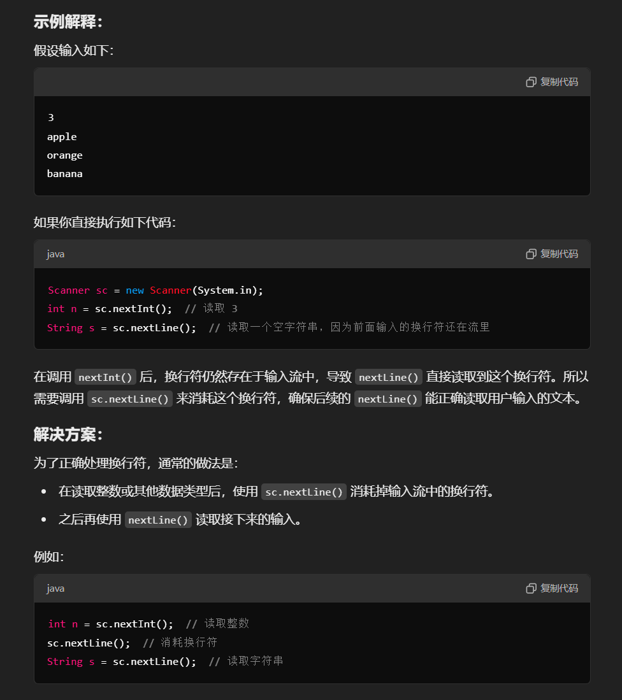

# ACM模式

### **ACM模式 **
# **好多acm模式的都需要消耗换行符**



---

# **卡码网**
#### **1. A+B问题I**
```java
import java.util.*; // 导入java.util包，用于使用Scanner类

public class Main {
    public static void main(String[] args) {
        // 创建一个Scanner对象，用于从标准输入读取数据
        Scanner in = new Scanner(System.in);
        
        // 使用while循环来持续读取输入，直到没有更多的整数输入
        while (in.hasNextInt()) {
            // 读取第一个整数并赋值给变量a
            int a = in.nextInt();
            // 读取第二个整数并赋值给变量b
            int b = in.nextInt();
            // 输出变量a和b的和
            System.out.println(a + b);
        }
    }
}
```

---

#### **2. A+B问题II**
```java
import java.util.*; // 导入java.util包，用于使用Scanner类

public class Main {
    public static void main(String[] args) {
        // 创建Scanner对象，用于从标准输入读取数据
        Scanner in = new Scanner(System.in);
        
        // 当输入中还有整数时，进入循环
        while (in.hasNextInt()) {
            // 读取第一个整数，表示接下来要处理的整数对的数量
            int N = in.nextInt();
            
            // 使用for循环，根据读取的数量N，循环N次
            for (int i = 0; i < N; i++) {
                // 读取第一个整数a
                int a = in.nextInt();
                // 读取第二个整数b
                int b = in.nextInt();
                // 输出整数a和b的和
                System.out.println(a + b);
            }
        }
    }
}
```

---

#### **3. A+B问题III**
```java
import java.util.*;

public class Main {
    public static void main(String[] args) {
        Scanner in = new Scanner(System.in);
        while (in.hasNextInt()) {
            int a = in.nextInt();
            int b = in.nextInt();
            // 如果输入的两个数均为0，则终止循环
            if (a == 0 && b == 0) break;
            System.out.println(a + b);
        }
    }
}
```

---

#### **4. A+B问题IV**
```java
import java.util.*;

public class Main {
    public static void main(String[] args) {
        Scanner in = new Scanner(System.in);
        while (in.hasNextInt()) {
            // 读取一组数据的整数个数
            int count = in.nextInt();
            // 如果输入为0，则终止循环
            if (count == 0) break;
            int sum = 0;
            // 累加count个整数
            for (int i = 0; i < count; i++) {
                sum += in.nextInt();
            }
            System.out.println(sum);
        }
    }
}
```

---

#### **5. A+B问题VII**
```java
import java.util.*;

public class Main {
    public static void main(String[] args) {
        Scanner in = new Scanner(System.in);
        while (in.hasNextLine()) {
            int a = in.nextInt();
            int b = in.nextInt();
            System.out.println(a + b + "\n");
        }
    }
}
```

---

#### **6. A+B问题VIII**
```java
import java.util.*; // 导入java.util包，这里主要是为了使用Scanner类

public class Main {
    public static void main(String[] args) {
        // 创建Scanner对象，用于从标准输入读取数据
        Scanner in = new Scanner(System.in);
        
        // 当输入中还有整数时，进入循环
        while (in.hasNextInt()) {
            // 读取第一个整数N，表示接下来有多少组数据
            int N = in.nextInt();
            
            // 外层循环，根据读取的数量N，循环N次处理每组数据
            for (int i = 0; i < N; i++) {
                // 初始化sum变量，用于累加每组数据的和
                int sum = 0;
                
                // 读取第二个整数M，表示接下来有M个整数需要累加
                int M = in.nextInt();
                
                // 内层循环，根据读取的数量M，循环M次累加整数
                for (int j = 0; j < M; j++) {
                    // 累加读取的整数到sum变量中
                    sum += in.nextInt();
                }
                
                // 判断是否是最后一组数据
                if (i == N - 1) {
                    // 如果是最后一组数据，直接打印sum，后面不换行
                    System.out.println(sum);
                } else {
                    // 如果不是最后一组数据，打印sum后换行
                    System.out.println(sum + "\n");
                }
            }
        }
        
        // 关闭Scanner对象（可选）
        // in.close();
    }
}
```

---

### **总结**
以上代码是常见的 **ACM模式** A+B问题变体，涉及以下几种情况：

1. **无限输入直到EOF**（`hasNextInt()`）。
2. **读取一个整数N，表示后续N组数据**。
3. **输入一对数，若均为0则终止**。
4. **输入一个数N，表示接下来有N个数，计算它们的和**。
5. **输入格式特殊，可能需要处理换行**。

这些代码适用于 **ACM竞赛** 或 **OJ系统**，常用于熟悉 Java **输入输出流** 及 **循环控制**。


> 更新: 2025-02-23 21:03:55  
> 原文: <https://www.yuque.com/neumx/ko4psh/xhni3efis39q1yl0>