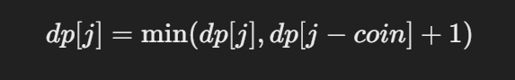

# 322. 零钱兑换

### 解题思路（同样<font style="color:#DF2A3F;">完全背包问题，这里是找到硬币，加起来等于n，不过 dp 数组要初始化成Integer.MAX_VALUE，</font>`<font style="color:#DF2A3F;"> dp[i] = Math.min(dp[i], dp[i - coin] + 1);</font>`）
### 解题思路：
1. **定义状态：** 我们定义一个数组 `dp`，其中 `dp[i]` 表示组成金额 `i` 所需的最小硬币数。初始时，`dp[0] = 0`（因为金额为0时不需要任何硬币），而其他的 `dp[i]` 初始值设置为一个较大的数，比如 `Integer.MAX_VALUE`，表示暂时还无法通过硬币组合成该金额。

**状态转移：** 对于每一种硬币，我们尝试更新从 `coins[i]` 到 `amount` 的所有 `dp[j]`。也就是说，若我们已经知道组成金额 `j - coin` 的最小硬币数，则可以通过增加一个 `coin` 来更新 `dp[j]`。即：



这里，`dp[j - coin] + 1` 表示在已有硬币组合的基础上，增加一个当前硬币 `coin`，得到金额 `j` 所需的硬币数。

2. **返回结果：** 最后，我们需要检查 `dp[amount]`，如果它的值仍然是初始值（表示无法组成该金额），则返回 `-1`；否则返回 `dp[amount]`。

### Java 代码
```java
public class Solution {
    public int coinChange(int[] coins, int amount) {
        // 定义一个dp数组，dp[i]表示组成金额i所需的最小硬币数
        int[] dp = new int[amount + 1];
        
        // 初始化，dp[0] = 0，表示金额为0时不需要任何硬币
        // 其他的初始值设置为一个较大的数，表示无法通过组合硬币得到
        for (int i = 1; i <= amount; i++) {
            dp[i] = Integer.MAX_VALUE;
        }
        
        // 遍历每个硬币
        for (int coin : coins) {
            // 从该硬币值开始更新dp数组
            for (int i = coin; i <= amount; i++) {
                // 如果 dp[i - coin] 不为 Integer.MAX_VALUE，说明存在组合方式
                if (dp[i - coin] != Integer.MAX_VALUE) {
                    dp[i] = Math.min(dp[i], dp[i - coin] + 1);
                }
            }
        }
        
        // 如果dp[amount]还是Integer.MAX_VALUE，说明无法组成该金额
        return dp[amount] == Integer.MAX_VALUE ? -1 : dp[amount];
    }
}

```

### 代码解释：
1. **初始化 **`**dp**`** 数组：** 我们用一个长度为 `amount + 1` 的 `dp` 数组来记录每个金额所需的最少硬币数。初始时，`dp[0] = 0`，表示零金额需要零硬币；其余的 `dp[i]` 初始为 `Integer.MAX_VALUE`，表示无法通过现有的硬币组合成金额 `i`。
2. **外层循环：** 对每种硬币进行遍历。对于每个硬币，我们尝试更新所有可能的金额 `i`。
3. **内层循环：** 从 `coin` 开始，到 `amount`，逐个检查金额 `i` 是否可以通过该硬币来更新。若能更新，则根据 `dp[i - coin] + 1` 更新当前 `dp[i]`。
4. **最终结果：** 如果 `dp[amount]` 仍然是 `Integer.MAX_VALUE`，说明无法凑成该金额，返回 `-1`；否则，返回 `dp[amount]`，即所需的最小硬币数。

### 时间复杂度：
+ 外层循环遍历每个硬币，时间复杂度为 O(m)，其中 m 是硬币的种类数。
+ 内层循环遍历每个金额，从 `coin` 到 `amount`，时间复杂度为 O(n)，其中 n 是金额 `amount`。
+ 所以总的时间复杂度是 O(m * n)。


### 


> 更新: 2025-03-02 19:14:45  
> 原文: <https://www.yuque.com/neumx/ko4psh/gl1aird6dc96m97x>