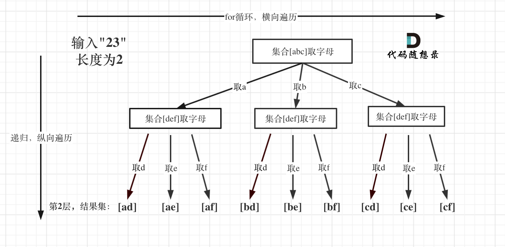

# 17. 电话号码的字母组合

### 精简思路（<font style="color:#DF2A3F;">建立一个字符串数组，然后先获得输入数字对应字符数组，再遍历这个数组进行递归</font>）
1. **映射关系**：
    - 数字 `2-9` 对应字母表： 

```java
2 -> "abc", 3 -> "def", 4 -> "ghi", ..., 9 -> "wxyz"
```

2. **回溯法**：
    - 每次从输入数字字符串的第一个数字开始，取其对应的字母，尝试加入当前组合。
    - 对下一个数字重复同样的操作，直到组合的长度等于输入字符串长度。
3. **递归终止条件**：
    - 当前组合长度等于输入数字的长度，将当前组合加入结果列表。
4. **回溯**：
    - 如果当前路径已经处理完，撤销上一步操作（回退），尝试下一个可能性。

---

### 举例分析
输入：`digits = "23"`

+ 第一个数字 `2` 对应 `"abc"`，第二个数字 `3` 对应 `"def"`。
+ 递归尝试： 
    - `a` -> `ad`, `ae`, `af`
    - `b` -> `bd`, `be`, `bf`
    - `c` -> `cd`, `ce`, `cf`

最终结果：`["ad", "ae", "af", "bd", "be", "bf", "cd", "ce", "cf"]`。

---

### 核心步骤总结
+ 用数字索引找到对应的字母。
+ 遍历每个字母，递归生成下一层组合。
+ 回溯到上一步，尝试其他可能的字母。

---

```java

public class Solution {
    /**
     * 主方法，用于生成所有电话号码对应的字母组合
     * @param digits 输入的数字字符串
     * @return 所有可能的字母组合
     */
    public List<String> letterCombinations(String digits) {
        // 如果输入为空，直接返回空列表
        if (digits == null || digits.isEmpty()) {
            return new ArrayList<>();
        }

        // 数字到字母的映射
        String[] mapping = {
            "",     // 0
            "",     // 1
            "abc",  // 2
            "def",  // 3
            "ghi",  // 4
            "jkl",  // 5
            "mno",  // 6
            "pqrs", // 7
            "tuv",  // 8
            "wxyz"  // 9
        };

        List<String> result = new ArrayList<>();
        backtrack(result, mapping, digits, 0, new StringBuilder());
        return result;
    }


    private void backtrack(List<String> result, String[] mapping, String digits, int index, StringBuilder current) {
        // 如果当前组合的长度等于输入数字的长度，则将其加入结果
        if (index == digits.length()) {
            result.add(current.toString());
            return;
        }

        // 获取当前数字对应的字母
        String letters = mapping[digits.charAt(index) - '0'];

        // 遍历每个字母，进行递归
        for (char letter : letters.toCharArray()) {
            current.append(letter); // 添加当前字母
            backtrack(result, mapping, digits, index + 1, current); // 递归处理下一个数字
            current.deleteCharAt(current.length() - 1); // 回溯，移除最后一个字母
        }
    }


}

```

### 时间复杂度：
+ 对于长度为 `n` 的数字字符串，假设最坏的情况是每个数字有 4 个对应的字母（例如数字 `7` 和 `9`），那么总共有 `4^n` 种组合。
+ 因此，时间复杂度为 `O(4^n)`，其中 `n` 是输入字符串的长度。

### 空间复杂度：
+ 主要的空间消耗在递归栈和存储结果上。递归的深度为 `n`，每次递归的栈空间开销是常数级别。
+ 因此，空间复杂度为 `O(n)`（递归栈）加上 `O(4^n)`（存储结果所需的空间）。


> 更新: 2025-02-22 22:25:07  
> 原文: <https://www.yuque.com/neumx/ko4psh/id83l82frwbuepnp>