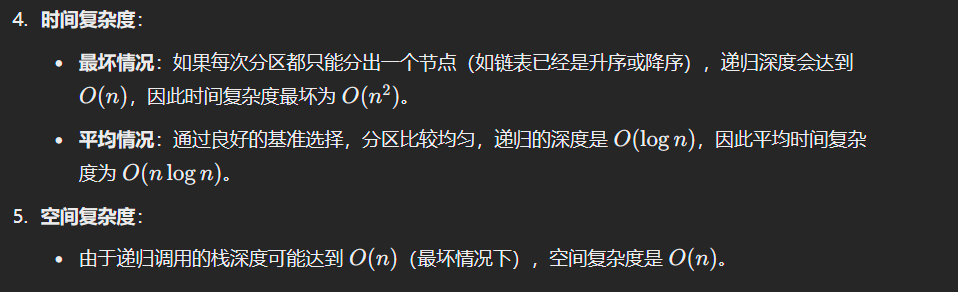

# 148. 排序链表

### 思路（<font style="color:#DF2A3F;">通过递归分治将链表分成两部分，每部分递归排序后合并成一个有序链表。</font>）
### 归并排序（<font style="color:#DF2A3F;">递归版归并排序</font>）
归并排序的基本思想是**分治法**，通过递归地将链表分成两半，分别对两半进行排序，再将两个已排序的子链表合并成一个有序链表。

**归并排序的步骤**：

1. **分割链表**：使用快慢指针将链表分割成两部分。
2. **递归排序**：对两个子链表进行递归排序。
3. **合并排序好的子链表**：将两个已排序的子链表合并成一个有序链表。

#### 代码
```java

class Solution {
    public ListNode sortList(ListNode head) {
        // 如果链表为空或只有一个节点，直接返回该节点
        if (head == null || head.next == null)
            return head;

        ListNode fast = head; // 快指针
        ListNode slow = head; // 慢指针
        ListNode prev = null; // 用于断开链表的前一个节点

        // 使用快慢指针找到链表的中间节点
        while (fast != null && fast.next != null) {
            prev = slow; // 记录慢指针的前一个节点
            slow = slow.next; // 慢指针前进一步
            fast = fast.next.next; // 快指针前进两步
        }

        // 切断链表，将前半部分和后半部分分开
        prev.next = null;

        // 递归排序链表的左右两部分
        ListNode left = sortList(head); // 左半部分
        ListNode right = sortList(slow); // 右半部分

        // 合并排序后的两部分并返回
        return merge(left, right);
    }

    // 合并两个已排序的链表
    private ListNode merge(ListNode l1, ListNode l2) {
        ListNode dummy = new ListNode(0); // 创建一个哑节点作为合并链表的头
        ListNode cur = dummy; // 当前合并链表的末尾

        // 合并两个有序链表
        while (l1 != null && l2 != null) {
            if (l1.val < l2.val) { // 如果 l1 的值小于 l2 的值
                cur.next = l1; // 将 l1 加入合并链表
                l1 = l1.next; // l1 后移
            } else {
                cur.next = l2; // 将 l2 加入合并链表
                l2 = l2.next; // l2 后移
            }
            cur = cur.next; // 更新合并链表的当前末尾
        }

        // 如果还有剩余的节点，直接连接到合并链表的末尾
        if (l1 != null)
            cur.next = l1;
        if (l2 != null)
            cur.next = l2;

        return dummy.next; // 返回合并后的链表（跳过哑节点）
    }
}
```

### 代码解释
1. `**sortList**`：
    - 递归地对链表进行排序。首先，调用 `findMid` 找到链表的中点，之后将链表拆成两半。
    - 然后递归地对左右两半进行排序，最后调用 `merge` 合并两个已排序的链表。
2. `**findMid**`：
    - 通过快慢指针的方式找到链表的中点，慢指针每次移动一步，快指针每次移动两步。当快指针到达链表末尾时，慢指针正好指向中点。
3. `**merge**`：
    - 合并两个已排序的链表。使用一个虚拟头节点 `dummy` 来简化代码，逐个比较两个链表的节点值，按顺序将节点连接起来。

### 时间复杂度
+ **时间复杂度**：`O(n log n)`，其中 `n` 是链表的节点数。每次拆分链表的时间复杂度是 `O(n)`，拆分的深度是 `O(log n)`，所以总的时间复杂度是 `O(n log n)`。
+ **空间复杂度**：`O(log n)`，这是递归的栈空间。虽然归并排序的空间复杂度通常是 `O(n)`，但对于链表而言，递归栈的深度是 `O(log n)`。

---

###  <font style="color:#DF2A3F;">迭代版归并排序 </font>  （自底向上归并排序  ）
归并排序的递归实现我们已经了解了，它的时间复杂度为 O(nlog⁡n)，空间复杂度为 O(log⁡n)。不过，递归版本在某些情况下可能会引发栈溢出（特别是在链表特别长时），或者在处理非常大的数据集时会导致性能开销。因此，迭代版本的归并排序能避免这种递归带来的栈深度问题，并且能实现更加稳定的排序。

迭代版本的归并排序采用自底向上的方式进行合并，首先将链表拆分成小的部分（初始长度为 1），然后逐步将这些小部分合并成较大的部分，直到最终得到一个有序链表。

### 迭代版归并排序的思路
1. **初始阶段：** 把链表分成小段，每段的大小为 1。
2. **合并阶段：** 通过逐步合并相邻的两段链表，逐渐扩大合并段的大小，直到整个链表合并成一个有序链表。
3. **过程：** 在每一轮合并时，我们将相邻的两个链表段合并，并继续合并，直到合并整个链表。

### 迭代归并排序的步骤
1. **初始化：** 首先，计算链表的总长度。然后，逐步增加每次合并的子链表长度，从 1 开始，逐步合并长度为 1、2、4、8 等的链表段。
2. **合并相邻段：** 每轮将链表分成两个相邻的段，分别进行合并，直到合并完成。
3. **停止条件：** 每次合并后，新的合并段的长度会翻倍，直到无法继续合并为止。

```java
class Solution {
    public ListNode sortList(ListNode head) {
        // 如果链表为空或只有一个节点，直接返回
        if (head == null || head.next == null) {
            return head;
        }

        // 计算链表的长度
        int len = 0;
        ListNode current = head;
        while (current != null) {
            len++;
            current = current.next;
        }

        // 创建一个虚拟头节点，用于简化链表的操作
        ListNode dummy = new ListNode(0);
        dummy.next = head;

        // 从子链表长度为1开始，逐步增加步长，每次合并子链表
        for (int step = 1; step < len; step *= 2) {  // 每次合并的子链表长度翻倍
            ListNode prev = dummy;  // prev指向合并后链表的尾部
            ListNode curr = dummy.next;  // curr指向当前处理的链表部分

            // 遍历链表，进行合并操作
            while (curr != null) {
                // 分别获取两个待合并的子链表
                ListNode left = curr;
                ListNode right = split(left, step); // 获取右半部分
                curr = split(right, step); // 获取下一个待合并的链表的起始位置

                // 合并两个子链表
                prev.next = merge(left, right);
                // 将合并后的链表移到末尾
                while (prev.next != null) {
                    prev = prev.next;
                }
            }
        }

        return dummy.next;  // 返回排序后的链表
    }

    // 分割链表，返回链表的第二部分
    private ListNode split(ListNode head, int step) {
        if (head == null) return null;

        ListNode cur = head;
        // 遍历step-1个节点，找到分割点
        for (int i = 1; cur != null && i < step; i++) {
            cur = cur.next;
        }

        // 如果到达链表末尾，返回null
        if (cur == null) return null;
        ListNode second = cur.next;  // 获取第二部分
        cur.next = null;  // 切断链表
        return second;
    }

    // 合并两个有序链表
    private ListNode merge(ListNode left, ListNode right) {
        ListNode dummy = new ListNode(0);  // 创建一个虚拟节点
        ListNode current = dummy;  // 当前节点指针，用于拼接

        // 遍历两个链表，按顺序合并
        while (left != null && right != null) {
            if (left.val <= right.val) {
                current.next = left;  // 将左侧节点连接到当前节点
                left = left.next;  // 左侧指针后移
            } else {
                current.next = right;  // 将右侧节点连接到当前节点
                right = right.next;  // 右侧指针后移
            }
            current = current.next;  // 移动当前节点指针
        }

        // 如果左侧链表还有剩余，直接连接到当前链表末尾
        if (left != null) {
            current.next = left;
        }

        // 如果右侧链表还有剩余，直接连接到当前链表末尾
        if (right != null) {
            current.next = right;
        }

        return dummy.next;  // 返回合并后的链表
    }
}

```

### 代码解释
1. `**sortList**`** 方法**：
    - 首先通过遍历链表来计算链表的长度 `len`。
    - 然后，我们开始进行迭代合并，每次合并的子链表的长度从 1 开始，并且在每一轮合并后，合并的子链表长度会翻倍。
    - 使用 `dummy` 节点来简化合并操作，`dummy.next` 作为链表的头节点，最终返回 `dummy.next`。
2. `**split**`** 方法**：
    - 通过指定步长 `step` 将链表分割成两段。返回链表的第二部分，并将链表的连接切断。这里的 `step` 控制每次切割的子链表长度。
3. `**merge**`** 方法**：
    - 合并两个已排序的链表。在 `merge` 方法中，我们比较两个链表的头节点，逐一将较小的节点连接到新的链表中，直到其中一个链表为空。
    - 如果一个链表遍历完了，另一个链表剩余的部分直接接到新链表的后面。

### 时间和空间复杂度
+ **时间复杂度**：O(n log n)
    - 其中，n 是链表的长度。在每次合并时，处理整个链表一次。每次合并的子链表大小是前一次的两倍，因此需要 `log n` 次合并操作。每次合并的时间复杂度是 O(n)，所以总时间复杂度是 O(n log n)。
+ **空间复杂度**：O(1)
    - 这个解法是原地排序的，没有使用额外的空间来存储链表。虽然递归版本的归并排序需要栈空间（O(log n)），但迭代版本通过迭代的方式避免了递归调用栈，因此空间复杂度是 O(1)

---

### <font style="color:#DF2A3F;">快排解法 （快排需要懂，以防面试官提问  ）</font>
### 题目背景
我们需要对一个链表进行排序。虽然常见的排序算法（如归并排序）在链表上比较高效，但快速排序同样也可以应用于链表，尤其是当链表较大时，快速排序的平均性能非常好。

### 快排在链表上的解法
快速排序的核心思想依然是通过 **分治** 来进行排序。通过选择一个**基准值**（pivot）将链表分成左右两部分，然后递归地对这两部分进行排序，直到子链表的大小为 0 或 1。

#### 快排的链表实现
1. **选择基准元素**：对于链表，可以选择链表的第一个节点或者链表的最后一个节点作为基准。
2. **分区操作**：通过一次遍历将链表分成两部分，左边部分小于基准，右边部分大于基准。
3. **递归排序**：递归地对左右两部分进行快速排序。

#### 快排在链表中的特点
1. **分区**：分区操作需要遍历链表，所以时间复杂度是 O(n)O(n)O(n)。
2. **递归深度**：在最好的情况下，快速排序的递归深度是 log⁡n\log nlogn，但最坏情况下可能退化为 nnn，因此在链表上，递归深度的控制非常重要。

### 快速排序链表的实现
```java


public class Solution {
    
    public ListNode quickSortList(ListNode head) {
        if (head == null || head.next == null) {
            return head; // 如果链表为空或者只有一个节点，直接返回
        }

        // 使用链表的最后一个元素作为基准元素
        ListNode pivot = head;
        ListNode left = new ListNode(0); // 左侧小于基准的链表
        ListNode right = new ListNode(0); // 右侧大于基准的链表
        ListNode equal = new ListNode(0); // 等于基准的链表

        // 分区操作，遍历整个链表
        ListNode l = left, r = right, e = equal;
        ListNode cur = head;
        while (cur != null) {
            if (cur.val < pivot.val) {
                l.next = cur; // 小于基准的元素加入左链表
                l = l.next;
            } else if (cur.val > pivot.val) {
                r.next = cur; // 大于基准的元素加入右链表
                r = r.next;
            } else {
                e.next = cur; // 等于基准的元素加入中间链表
                e = e.next;
            }
            cur = cur.next;
        }

        // 结束部分要指向 null，防止环状链表
        r.next = null;
        e.next = null;
        l.next = null;

        // 对左右两边链表递归排序
        left.next = quickSortList(left.next);
        right.next = quickSortList(right.next);

        // 合并结果
        // 先连接左侧链表
        if (left.next != null) {
            l.next = equal.next;
        } else {
            left.next = equal.next;
        }
        // 最后连接右侧链表
        e.next = right.next;

        // 返回排序后的链表头
        return left.next;
    }
}

```

### 代码解析
1. **分区操作**：
    - 创建三个虚拟头节点 `left`, `right`, `equal` 来分别存储小于基准、等于基准和大于基准的链表。
    - 遍历链表，将每个节点根据它和基准的关系分配到不同的链表中。
    - 最后，分别对这些链表递归排序。
2. **递归**：
    - 对 `left` 和 `right` 递归地调用快速排序。
    - 通过递归对左右子链表进行排序。
    - 通过拼接 `left`、`equal` 和 `right` 来得到最终的排序链表。
3. **拼接**：
    - 对排序后的链表进行合并。将 `left` 链表连接到 `equal` 链表，再将 `equal` 链表连接到 `right` 链表。
+ 


> 更新: 2025-03-25 22:32:53  
> 原文: <https://www.yuque.com/neumx/ko4psh/dh1i9tn4pqmlcy6h>