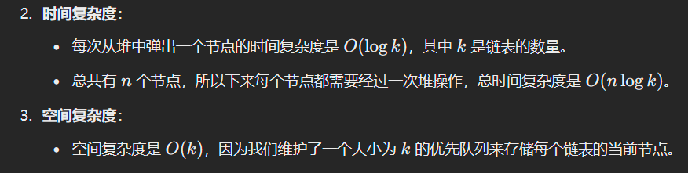

# 23. 合并 K 个升序链表

### 思路（<font style="color:#DF2A3F;">通过使用最小堆（优先队列），每次取出最小值加入结果链表并更新堆，最终合并成一个有序链表。</font>）
### 优先队列（小顶堆）法
这个问题可以通过使用最小堆（优先队列）来高效地合并 K 个升序链表。每次从 K 个链表中选择最小的元素，合并到结果链表中，直到所有链表中的元素都被处理完。具体思路如下：

1. 使用优先队列（最小堆），它可以帮助我们高效地从 K 个链表中找到最小元素。
2. 将每个链表的头节点加入到最小堆中。
3. 每次从最小堆中取出一个最小元素，并将该元素所在链表的下一个节点加入到堆中。
4. 最终将所有元素合并为一个有序链表。

#### 代码
```java
class Solution {
    // 定义一个合并K个有序链表的方法
    public ListNode mergeKLists(ListNode[] lists) {
        // 使用优先队列（小顶堆）来存储链表节点，根据节点的值进行排序
        PriorityQueue<ListNode> minheap = new PriorityQueue<>((a, b) -> a.val - b.val);

        // 遍历传入的链表数组
        for (ListNode head : lists) {
            // 如果链表头节点不为空，则将头节点加入到优先队列中
            if (head != null) {
                minheap.offer(head);
            }
        }
        // 创建一个哑节点（dummy node），它将作为合并后链表的前驱节点
        ListNode dummy = new ListNode(0);
        // 初始化当前节点指针cur指向哑节点，用于构建最终的合并链表
        ListNode cur = dummy;

        // 当优先队列不为空时，执行循环
        while (!minheap.isEmpty()) {
            // 从优先队列中取出当前最小的节点
            ListNode node = minheap.poll();
            // 将取出的节点链接到cur后面，然后移动cur指针到下一个位置
            cur.next = node;
            cur = cur.next;
            // 如果取出的节点后面还有节点，则将下一个节点加入到优先队列中
            if (node.next != null) {
                minheap.offer(node.next);
            }
        }

        // 返回合并后链表的头节点，即哑节点的下一个节点
        return dummy.next;
    }
}
```

### 代码解释：
1. **ListNode 类**：表示链表节点，包含值 `val` 和指向下一个节点的指针 `next`。
2. **mergeKLists 方法**：
    - 使用 `PriorityQueue`（优先队列）来实现最小堆，堆的每个元素是链表节点。
    - 首先，将每个链表的头节点加入到堆中。
    - 然后，不断从堆中取出最小的节点，并将其加入到结果链表中。若取出的节点有下一个节点，则将该下一个节点加入堆中。
    - 最终返回合并后的链表。
3. **虚拟头节点**：为了方便处理链表的头部，使用一个虚拟头节点 `dummy`，最终返回 `dummy.next` 即为合并后的链表。

### 时间和空间复杂度：
+ 

---

###  分治法（归并排序）  
 分治法的思路是将多个链表一对一地合并，直到最终得到一个合并后的链表。可以将问题不断拆分，直到每次只合并两个链表，合并后的链表再和下一个链表合并，最终得到最终的排序链表。  

```java
class Solution {
    // 主方法：合并k个已排序的链表
    public ListNode mergeKLists(ListNode[] lists) {
        // 如果输入为空或数组长度为0，直接返回null
        if (lists == null || lists.length == 0) return null;
        // 调用分治法来合并所有链表
        return merge(lists, 0, lists.length - 1);
    }

    // 使用分治法合并链表区间
    private ListNode merge(ListNode[] lists, int left, int right) {
        // 递归终止条件：当left等于right时，返回对应的链表
        if (left == right) return lists[left];
        
        // 计算中间点
        int mid = left + (right - left) / 2;
        
        // 递归合并左半部分链表
        ListNode leftList = merge(lists, left, mid);
        // 递归合并右半部分链表
        ListNode rightList = merge(lists, mid + 1, right);
        
        // 合并左半部分和右半部分的链表
        return mergeTwoLists(leftList, rightList);
    }

    // 合并两个已排序的链表
    private ListNode mergeTwoLists(ListNode l1, ListNode l2) {
        // 创建一个虚拟节点，用于简化链表操作
        ListNode dummy = new ListNode(0);
        // current指针用于遍历新链表
        ListNode cur = dummy;
        
        // 遍历两个链表，按顺序合并
        while (l1 != null && l2 != null) {
            // 比较两个链表的当前节点值，将较小的节点接到新链表中
            if (l1.val < l2.val) {
                cur.next = l1;
                l1 = l1.next;  // l1指针后移
            } else {
                cur.next = l2;
                l2 = l2.next;  // l2指针后移
            }
            cur = cur.next;  // current指针后移
        }

        // 如果l1还有剩余节点，直接将剩余节点接到新链表中
        if (l1 != null) cur.next = l1;
        // 如果l2还有剩余节点，直接将剩余节点接到新链表中
        if (l2 != null) cur.next = l2;

        // 返回合并后的链表，跳过虚拟头节点
        return dummy.next;
    }
}

```

### 代码解读：
1. `**mergeKLists**`：这是合并 `k` 个已排序链表的主方法。它首先判断输入是否合法，如果不合法直接返回 `null`。然后调用 `merge` 方法，使用分治法合并所有链表。
2. `**merge**`：这是实现分治法的递归方法。它会递归地将链表数组分成两半，直到每个子数组只包含一个链表。然后通过 `mergeTwoLists` 方法合并两个子链表。
    - 如果 `left == right`，说明这个范围内只有一个链表，直接返回该链表。
    - 否则，计算中间点 `mid`，然后递归地将左半部分和右半部分的链表合并，再将它们合并成一个大的链表。
3. `**mergeTwoLists**`：这是合并两个已排序链表的辅助方法。通过比较两个链表的当前节点值，逐步将较小的节点接到新的链表中，直到一个链表为空。接着，如果另一个链表还有剩余元素，直接将其接到新的链表末尾。
4. `**dummy**`** 和 **`**cur**`：这两个变量用于简化链表操作。`dummy` 是一个虚拟头节点，`cur` 是指向当前合并链表的指针。在实际操作中，我们操作的是 `dummy.next`，通过 `cur` 来遍历新链表。

### 时间复杂度与空间复杂度：
### 复杂度分析：
+ **时间复杂度**：
    - 由于分治法每次将问题分成两半，每次合并两个链表需要 `O(n)` 时间（其中 `n` 是链表的长度），而递归深度是 `O(log k)`（`k` 是链表数量）。因此总的时间复杂度是 `O(n log k)`，其中 `n` 是所有链表中节点的总数。
+ **空间复杂度**：
    - 递归深度为 `O(log k)`，因此空间复杂度是 `O(log k)`，用于存储递归调用的栈空间。


> 更新: 2025-03-25 22:43:47  
> 原文: <https://www.yuque.com/neumx/ko4psh/wt1e2qg6c2asmiu0>