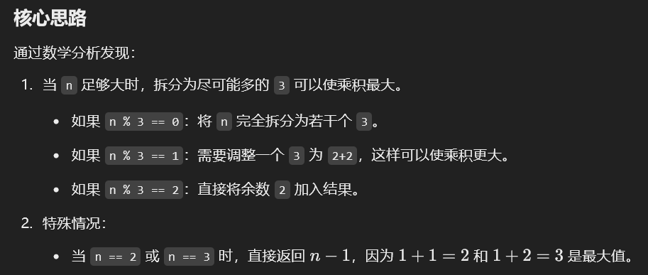

# 343. 整数拆分

### 方法一：动态规划
#### 思路
1. **定义状态**：
    - `dp[i]` 表示正整数 `i` 的最大乘积。
2. **状态转移方程**：
    - 对于每个数 `i`，我们将其拆分为两部分：`j` 和 `i-j`（1 <= j < i）。
    - 两部分的最大乘积有两种选择：
        * 不继续拆分：直接使用 `j * (i-j)`；
        * 继续拆分：使用 `j * dp[i-j]`。
    - 因此：

`dp[i] = max(dp[i], max(j * (i-j), j * dp[i-j]))`

3. **初始状态**：
    - `dp[2] = 1`，因为 `2 = 1 + 1`，乘积为 `1 * 1 = 1`。
4. **遍历顺序**：
    - 从小到大计算 `dp`，最终得到 `dp[n]`。

#### 动态规划代码
```java
public class Solution {
    public int integerBreak(int n) {
        // dp 数组，dp[i] 表示整数 i 的最大乘积
        int[] dp = new int[n + 1];
        dp[2] = 1; // 初始化

        // 从 3 到 n 依次计算每个 dp[i]
        for (int i = 3; i <= n; i++) {
            for (int j = 1; j < i; j++) {
                // 最大乘积是拆分为 j 和 i-j 的结果，或继续拆分 i-j 的结果
                dp[i] = Math.max(dp[i], Math.max(j * (i - j), j * dp[i - j]));
            }
        }

        return dp[n]; // 返回结果
    }
}
```

#### 时间复杂度和空间复杂度
+ 

---

### 方法二：数学推导（贪心算法）
#### 思路
1. 

#### 贪心算法代码
```java
public class Solution {
    public int integerBreak(int n) {
        // 特殊情况
        if (n == 2) return 1;
        if (n == 3) return 2;

        int product = 1;
        // 拆分出尽可能多的 3
        while (n > 4) {
            product *= 3;
            n -= 3;
        }

        // 剩下的部分直接相乘
        product *= n;
        return product;
    }
```

#### 时间复杂度和空间复杂度
+ 


> 更新: 2025-01-14 22:36:06  
> 原文: <https://www.yuque.com/neumx/ko4psh/xdwbnw7pe4o0bztg>