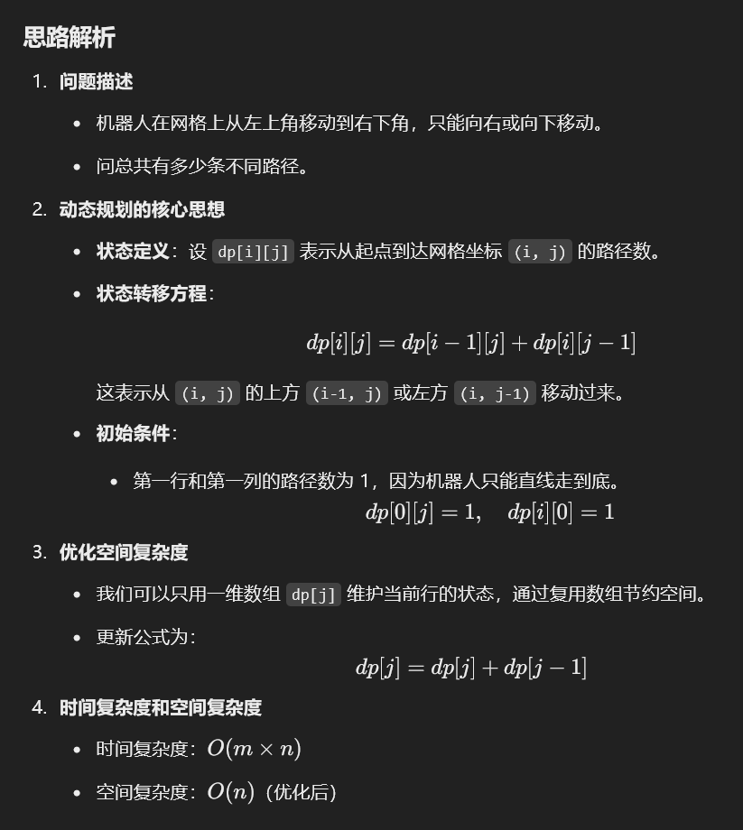

# 62. 不同路径

### 解题思路（<font style="color:#DF2A3F;">初始化第一行，第一列，然后只能从上面或者左面过来</font>）
### 
---

```java
public class Solution {
    public int uniquePaths(int m, int n) {
        // 初始化一个大小为 m x n 的二维数组 dp
        int[][] dp = new int[m][n];
        
        // 第一列初始化为1，因为只有一种路径到达每个点（一直向下）
        for (int i = 0; i < m; i++) {
            dp[i][0] = 1;
        }
        
        // 第一行初始化为1，因为只有一种路径到达每个点（一直向右）
        for (int j = 0; j < n; j++) {
            dp[0][j] = 1;
        }
        
        // 填充 dp 数组
        for (int i = 1; i < m; i++) {
            for (int j = 1; j < n; j++) {
                // 状态转移方程：到达 (i, j) 的路径数 = 上方的路径数 + 左方的路径数
                dp[i][j] = dp[i-1][j] + dp[i][j-1];
            }
        }
        
        // 返回最终到达终点的路径数，因为下标从0开始，所以最后要m-1,n-1
        return dp[m-1][n-1];
    }
}

```

### 时间复杂度
+ 该代码使用两层嵌套 `for` 循环，外层执行 `m` 次，内层对每个外层元素执行 `n` 次。
+ 元素计算 `dp[i][j] = dp[i-1][j] + dp[i][j-1]` 为常数时间操作。
+ 故时间复杂度为 `O(mn)`。

### 空间复杂度
+ 创建 `m` 行 `n` 列的二维数组 `dp`。
+ 空间复杂度为 `O(mn)`，取决于 `m` 和 `n` 的大小。

综上所述，该代码的时间复杂度和空间复杂度均为 `O(mn)`。

## 优化版本
```java
public class UniquePaths {
    public int uniquePaths(int m, int n) {
        // 使用一个数组存储路径数
        int[] dp = new int[n];
        // 初始化数组，第一行的路径数全为 1
        for (int j = 0; j < n; j++) {
            dp[j] = 1;
        }
        
        // 从第二行开始逐步更新路径数
        for (int i = 1; i < m; i++) { // 遍历每一行
            for (int j = 1; j < n; j++) { // 遍历每一列（从第 1 列开始，因为第 0 列始终是 1）
                dp[j] = dp[j] + dp[j - 1]; // 当前格子的路径数等于上方和左边路径数的和
            }
        }
        
        // 最终右下角的路径数
        return dp[n - 1];
    }
```

### 


> 更新: 2025-01-14 21:52:23  
> 原文: <https://www.yuque.com/neumx/ko4psh/nini7kfo7tb1yfl4>