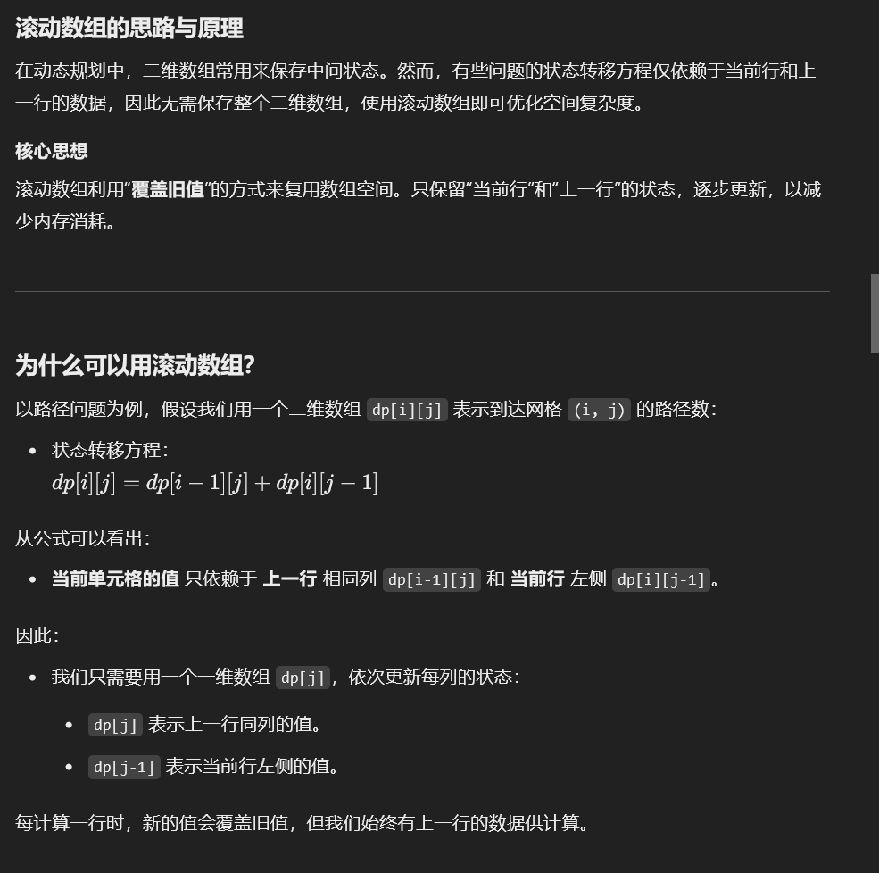
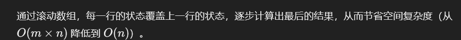

# 63. 不同路径 II

### 解题思路（<font style="color:#DF2A3F;">跟前面比，多了一个障碍，碰到障碍，</font>`<font style="color:#DF2A3F;">dp[i][j] = 0</font>`）
1. **定义状态**:
    - `dp[i][j]` 表示从左上角 `(0, 0)` 到当前位置 `(i, j)` 的不同路径数量。
2. **状态转移方程**:
    - 如果当前格子 `(i, j)` 没有障碍物（`grid[i][j] == 0`），
        * `dp[i][j] = dp[i-1][j] + dp[i][j-1]`（来自上方或左侧的路径数之和）。
    - 如果有障碍物（`grid[i][j] == 1`），
        * `dp[i][j] = 0`（不可达）。
3. **初始化**:
    - 如果起点 `(0, 0)` 有障碍物，直接返回 0。
    - 初始化第一行和第一列的路径数量，遇到障碍物后，其后面的所有路径数均为 0。
4. **结果**:
    - `dp[m-1][n-1]` 即为所求的结果。

---

```java
public class Solution {
    public int uniquePathsWithObstacles(int[][] obstacleGrid) {
        int m = obstacleGrid.length; // 网格的行数
        int n = obstacleGrid[0].length; // 网格的列数

        // 如果起点或终点有障碍物，直接返回 0
        if (obstacleGrid[0][0] == 1 || obstacleGrid[m - 1][n - 1] == 1) {
            return 0;
        }

        // 创建 dp 数组，dp[i][j] 表示到达位置 (i, j) 的路径数量
        int[][] dp = new int[m][n];

        // 初始化起点
        dp[0][0] = 1;

        // 初始化第一行
        for (int j = 1; j < n; j++) {
            if (obstacleGrid[0][j] == 1) {
                dp[0][j] = 0; // 如果遇到障碍物，后续位置路径数都为 0
            } else {
                dp[0][j] = dp[0][j - 1]; // 向右累计路径数
            }
        }

        // 初始化第一列
        for (int i = 1; i < m; i++) {
            if (obstacleGrid[i][0] == 1) {
                dp[i][0] = 0; // 如果遇到障碍物，后续位置路径数都为 0
            } else {
                dp[i][0] = dp[i - 1][0]; // 向下累计路径数
            }
        }

        // 填充 dp 数组
        for (int i = 1; i < m; i++) {
            for (int j = 1; j < n; j++) {
                if (obstacleGrid[i][j] == 1) {
                    dp[i][j] = 0; // 如果当前位置有障碍物，路径数为 0
                } else {
                    dp[i][j] = dp[i - 1][j] + dp[i][j - 1]; // 路径数等于上方和左侧路径数之和
                }
            }
        }

        // 返回终点的路径数
        return dp[m - 1][n - 1];
    }
}
```

## 复杂度


### 方法 2： 空间优化（滚动数组）  


```java
public class Solution {
    public int uniquePathsWithObstacles(int[][] grid) {
        int m = grid.length; // 获取网格的行数
        int n = grid[0].length; // 获取网格的列数

        // 如果起点或终点有障碍物，直接返回 0，因为没有路径可以到达终点
        if (grid[0][0] == 1 || grid[m - 1][n - 1] == 1) {
            return 0;
        }

        // 初始化一维滚动数组，用于记录每列的路径数
        int[] dp = new int[n];
        dp[0] = 1; // 起点的路径数量设为 1，因为只有一种方式到达起点

        // 遍历整个网格，逐行计算路径数量
        for (int i = 0; i < m; i++) { // 外层循环遍历每一行
            for (int j = 0; j < n; j++) { // 内层循环遍历每一列
                if (grid[i][j] == 1) { 
                    // 如果当前格子有障碍物，将路径数设为 0，因为无法通过该格子
                    dp[j] = 0;
                } else if (j > 0) { 
                    // 如果当前格子没有障碍物，累加左侧的路径数
                    // 这里的 dp[j] 表示从上一行传递下来的路径数
                    // dp[j - 1] 表示当前行左侧的路径数
                    dp[j] += dp[j - 1];
                }
                // 如果 j == 0，不需要累加左侧路径数，因为第一列没有左侧格子
            }
        }

        // 返回右下角的路径数量，即 dp[n - 1]
        // dp 数组的最后一个元素表示从起点到达终点的所有路径数
        return dp[n - 1];
    }
}

```

### 总结
+ **时间复杂度**：`O(mn)`
+ **空间复杂度**：
    - 


> 更新: 2025-01-14 22:28:13  
> 原文: <https://www.yuque.com/neumx/ko4psh/hlwzdf1nhyrxlfpr>