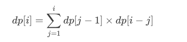

# 96. 不同的二叉搜索树

### 动态规划思路：
1. **定义状态**：设 `dp[i]` 表示由 `i` 个节点组成的二叉搜索树的数量。
2. **初始条件**：当 `n = 0` 时，空树也算一种情况，所以 `dp[0] = 1`。当 `n = 1` 时，只有一个节点，`dp[1] = 1`。
3. **状态转移方程**：对于 `i` 个节点，我们可以选择其中一个节点作为根节点，假设选择第 `j` 个节点作为根节点，那么左子树有 `j-1` 个节点，右子树有 `i-j` 个节点。因此，`dp[i]` 可以表示为：



4. **最终结果：**`dp[n]`** 就是我们要求的结果。  **

### 为什么不需要显式考虑“左大右小”？
二叉搜索树的性质是：

+ 对于任意一个节点，**左子树的所有节点值都小于它**，**右子树的所有节点值都大于它**。

但在这个问题中，我们只需要计算**结构**的数量，而不是具体的树。因为节点值是唯一的（从 1 到 n），所以对于任意一个节点作为根节点，左子树和右子树的节点数量是固定的，而具体的节点值可以通过排列组合来保证 BST 的性质。

### 动态规划的推导
假设我们有 `n` 个节点，值为 `1` 到 `n`。如果我们选择第 `j` 个节点作为根节点：

+ 左子树必须包含 `1` 到 `j-1` 的节点，共 `j-1` 个节点。
+ 右子树必须包含 `j+1` 到 `n` 的节点，共 `n-j` 个节点。

因此，左子树和右子树的结构数量分别是 `dp[j-1]` 和 `dp[n-j]`。由于左右子树的结构是独立的，总的树的数量就是它们的乘积。

#### 动态规划代码
```java
public class Solution {
    public int numTrees(int n) {
        // 创建一个数组来存储不同节点数量的二叉搜索树的数量
        int[] dp = new int[n + 1];
        dp[0] = 1; // 空树也算一种情况
        dp[1] = 1; // 只有一个节点的情况

        // 从2开始计算，直到n
        for (int i = 2; i <= n; i++) {
            // 对于每个i，计算以j为根节点的二叉搜索树的数量
            for (int j = 1; j <= i; j++) {
                // dp[j-1]表示左子树的数量，dp[i-j]表示右子树的数量
                // 两者相乘即为以j为根节点的二叉搜索树的总数
                dp[i] += dp[j - 1] * dp[i - j];
            }
        }

        // 返回n个节点的二叉搜索树的总数
        return dp[n];
    }
}
```

#### 时间复杂度和空间复杂度
+ **时间复杂度**：`O(n^2)`，因为有两层循环。
+ **空间复杂度**：`O(n)`，只需要一个大小为 `n+1` 的数组存储结果。


> 更新: 2025-01-16 21:46:07  
> 原文: <https://www.yuque.com/neumx/ko4psh/hr807f8hg8peekbf>