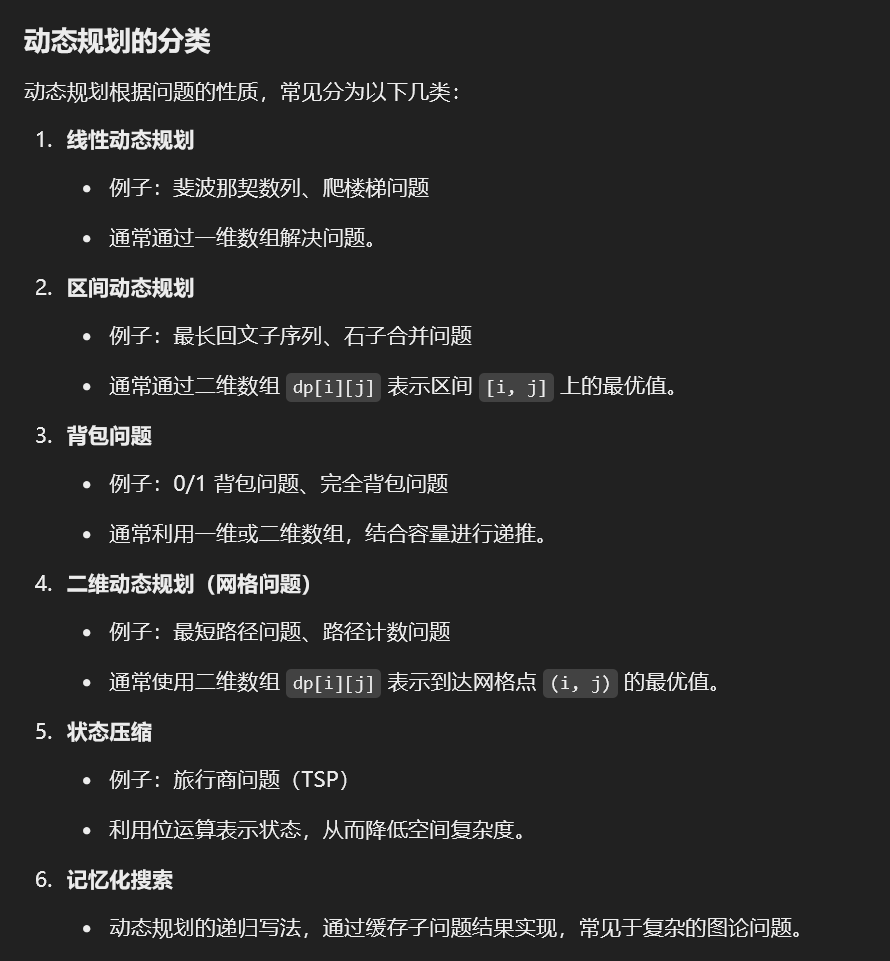

# 动态规划

动态规划（Dynamic Programming, DP）是一种用于解决最优化问题的算法思想，特别适合解决具有**重叠子问题**和**最优子结构**性质的问题。在 Java 中，动态规划可以通过数组或集合来存储中间结果，从而避免重复计算。

### 动态规划的核心思想
1. **重叠子问题**：问题可以分解为子问题，子问题之间会有重叠。通过存储已经解决的子问题的结果，可以避免重复计算。
2. **最优子结构**：一个问题的最优解由其子问题的最优解构成。即，局部最优能导致全局最优。
3. **状态转移方程**：通过分析问题的特点，找到状态间的转移关系，构建递推公式。

> 更新: 2025-01-13 16:56:06  
> 原文: <https://www.yuque.com/neumx/ko4psh/raqppmz76yb11tv0>