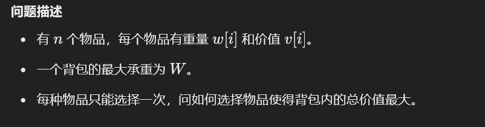
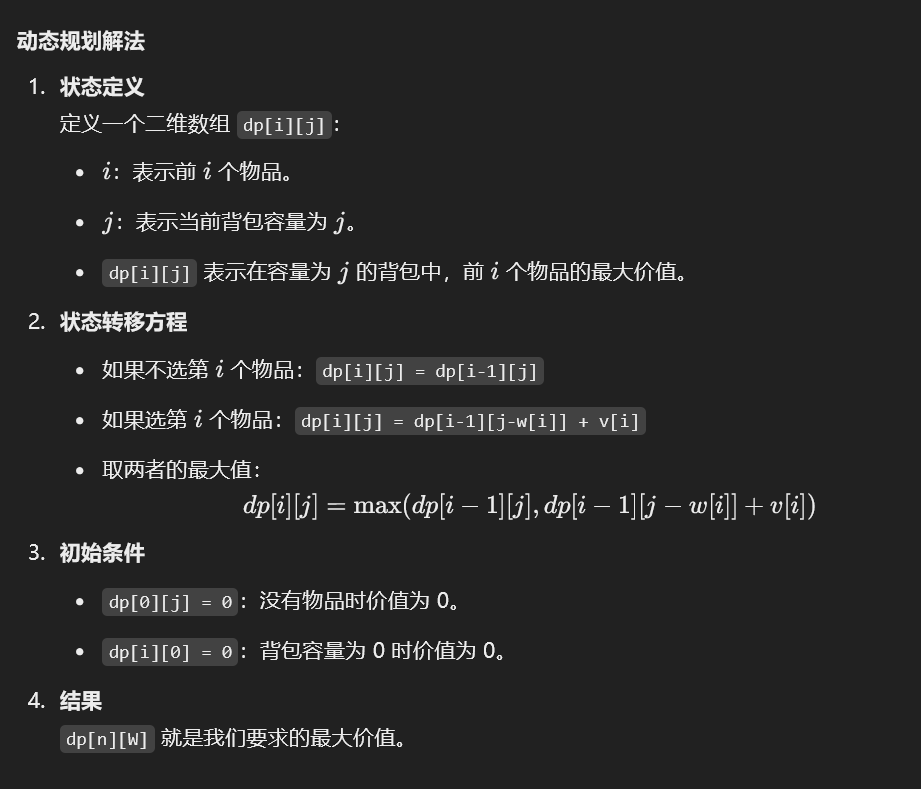
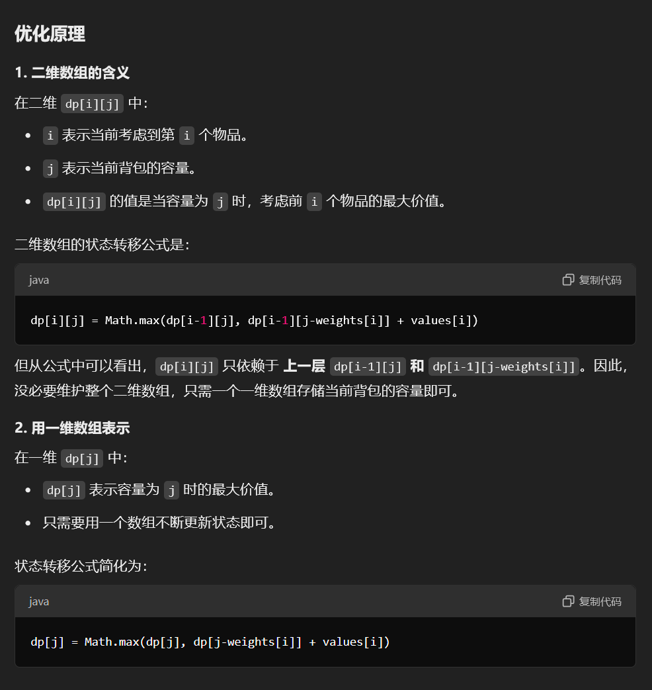
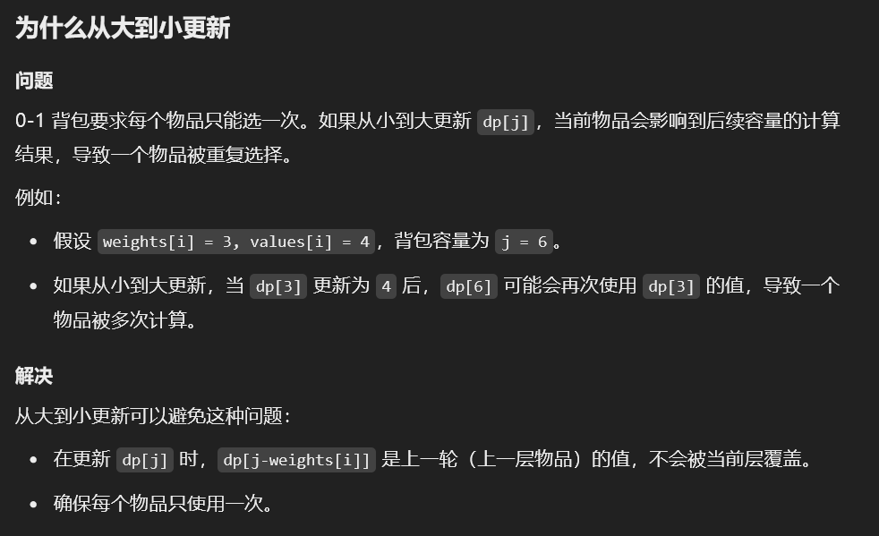
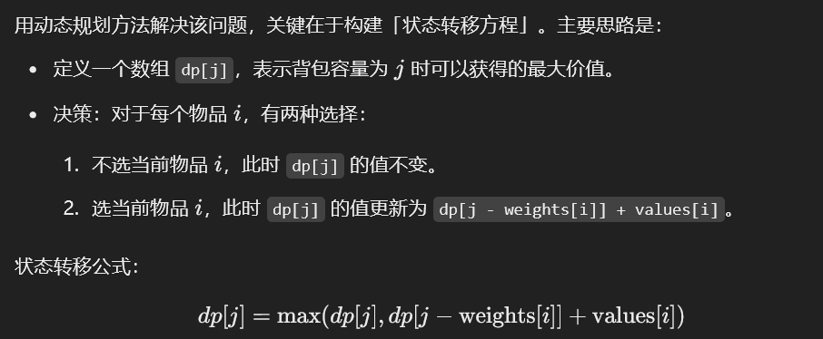
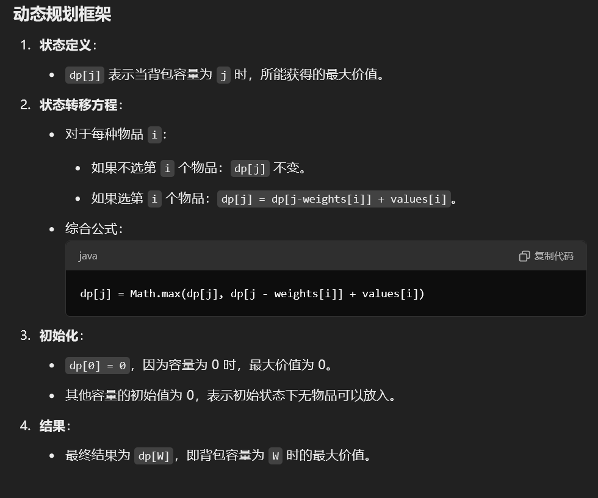
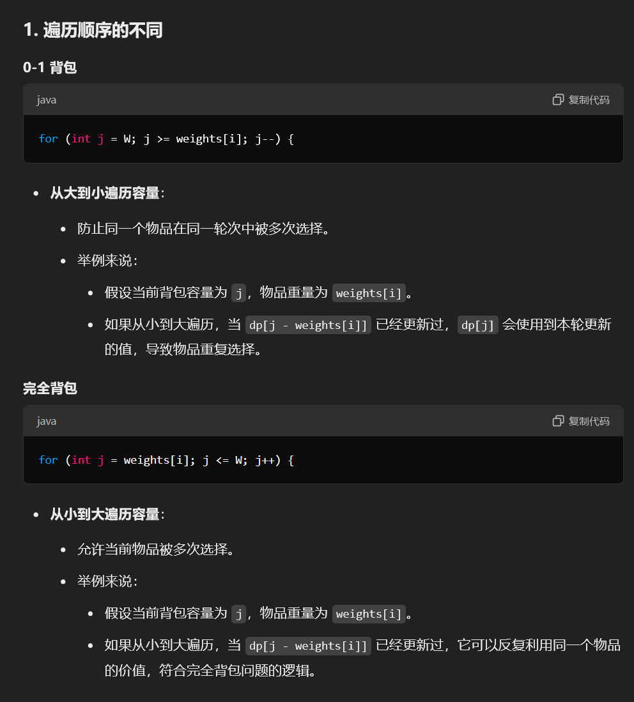

# 背包问题

背包问题是动态规划中的经典问题，主要用来解决如何在一定容量限制下选择物品以达到最优值的问题。背包问题有多种变体，常见的有 **0/1 背包**、**完全背包** 和 **多重背包**。

---

### 一、0/1 背包问题
#### 问题描述
+ 

---

#### 动态规划解法


---

#### Java 实现
```java
public class ZeroOneKnapsack {
    public static int knapsack(int[] w, int[] v, int W) {
        int n = w.length;
        int[][] dp = new int[n + 1][W + 1];

        // 遍历物品
        for (int i = 1; i <= n; i++) {
            // 遍历背包容量
            for (int j = 1; j <= W; j++) {
                if (j >= w[i - 1]) {
                    // 当前容量可以放下第 i 个物品
                    dp[i][j] = Math.max(dp[i - 1][j], dp[i - 1][j - w[i - 1]] + v[i - 1]);
                } else {
                    // 当前容量无法放下第 i 个物品
                    dp[i][j] = dp[i - 1][j];
                }
            }
        }
        return dp[n][W];
    }
}
```

---

#### 优化为一维数组
**<font style="color:#DF2A3F;">一维滚动数组优化，就记住这个答案就行了，以后用一维的</font>**



**<font style="color:#DF2A3F;">之所以倒序遍历，是为了确保每个物品只被计算一次，避免重复使用同一个物品。</font>**





```java
public int knapsack01Optimized(int[] weights, int[] values, int W) {
    int n = weights.length; // 获取物品的数量
    // 定义一维数组 dp，表示背包容量为 j时可以获得的最大价值
    // 初始时 dp[j] = 0，表示未放入任何物品
    int[] dp = new int[W + 1]; 

    // 遍历每一个物品
    for (int i = 0; i < n; i++) {
        // 遍历背包容量
        // 从背包容量 W 开始，倒序遍历到当前物品的重量 weights[i]
        // 倒序的原因是，避免在本轮更新时使用到已经更新过的 dp[j - weights[i]]
        for (int j = W; j >= weights[i]; j--) {
            // 状态转移方程：
            // dp[j] 表示当前容量为 j 时的最大价值
            // 比较两种情况：
            // 1. 不选择当前物品 i，价值为 dp[j]
            // 2. 选择当前物品 i，价值为 dp[j - weights[i]] + values[i]
            dp[j] = Math.max(dp[j], dp[j - weights[i]] + values[i]);
        }
    }

    // dp[W] 表示背包容量为 W 时的最大价值
    return dp[W];
}

```

---

### 二、完全背包问题
#### 
---

#### Java 实现
```java
public int completeKnapsack(int[] weights, int[] values, int W) {
    int n = weights.length; // 获取物品的数量
    // 定义一维数组 dp，表示背包容量为 j 时的最大价值
    // dp[j] 的含义：在考虑所有物品的情况下，背包容量为 j 时的最大价值
    int[] dp = new int[W + 1]; 

    // 遍历每一个物品
    for (int i = 0; i < n; i++) {
        // 完全背包问题：每件物品可以取无限次
        // 因此我们需要从小到大遍历背包容量 j，表示可以多次选取物品 i
        for (int j = weights[i]; j <= W; j++) {
            // 状态转移方程：
            // 如果不选择当前物品 i，dp[j] 保持原值
            // 如果选择当前物品 i，价值为 dp[j - weights[i]] + values[i]
            dp[j] = Math.max(dp[j], dp[j - weights[i]] + values[i]);
        }
    }

    // dp[W] 表示在容量为 W 的情况下，背包的最大价值
    return dp[W];
}

```

---

### 总结
**0-1 背包问题**和**完全背包问题**的核心区别就在于 **遍历背包容量的顺序不同，状态转移方程一样的**



### 0-1 背包
+ 每个物品只能选一次。
+ **必须从大到小遍历**，确保每个物品在本轮循环中只使用一次。

### 完全背包
+ 每个物品可以选无限次。
+ **必须从小到大遍历**，确保在同一轮循环中可以多次利用当前物品的价值。


> 更新: 2025-01-13 22:09:04  
> 原文: <https://www.yuque.com/neumx/ko4psh/uk7gfdhxgkdl1grf>