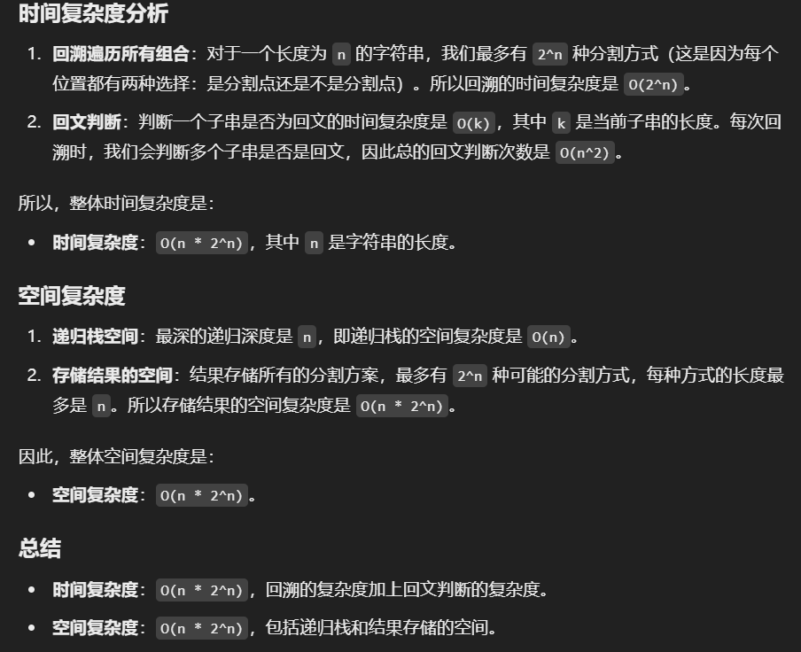

# 131.分割回文串

### 思路（<font style="color:#DF2A3F;">回溯+双指针判断是否是回文串</font>）
+ **回溯法**：通过回溯来尝试所有可能的分割方式。我们需要尝试将字符串 `s` 的每个前缀作为一个子串，并判断这个子串是否是回文串。如果是回文串，就继续递归处理剩余的部分。
+ **回文判断**：为了提高效率，判断一个子串是否是回文串，我们可以通过双指针来进行验证。每次递归选择一个前缀时，判断该前缀是否为回文，如果是，则将该前缀加入当前分割方案并继续递归处理剩余的部分。
+ **剪枝**：如果当前的子串不是回文串，就直接返回，避免不必要的递归。

---

```java
public class Solution {
    public List<List<String>> partition(String s) {
        // 存储最终的所有分割方案
        List<List<String>> res = new ArrayList<>();
        // 存储当前的分割路径
        List<String> path = new ArrayList<>();
        // 调用回溯算法，初始位置为字符串的第一个字符
        backtrack(s, 0, path, res);
        return res;
    }
    private void backtrack(String s, int start, List<String> path, List<List<String>> res) {
        // 如果起始位置已经到达字符串末尾，说明找到了一种有效的分割方案
        if (start == s.length()) {
            // 将当前路径添加到结果集中
            res.add(new ArrayList<>(path));
            return;
        }
        
        // 从起始位置 start 开始，尝试不同长度的子串
        for (int i = start; i < s.length(); i++) {
            // 如果从 start 到 i 位置的子串是回文串
            if (isPalindrome(s, start, i)) {
                // 将这个回文子串加入到当前路径中
                path.add(s.substring(start, i + 1)); 
                // 递归处理剩余的字符串部分，从 i+1 位置开始
                backtrack(s, i + 1, path, res); 
                // 回溯，移除当前子串，尝试其他分割方案
                path.remove(path.size() - 1); 
            }
        }
    }
    // 判断字符串 s 从 [start, end] 区间的子串是否为回文串
    private boolean isPalindrome(String s, int start, int end) {
        // 双指针法判断回文
        while (start < end) {
            // 如果两端字符不相等，则不是回文串
            if (s.charAt(start) != s.charAt(end)) {
                return false;
            }
            // 移动指针
            start++;
            end--;
        }
        return true; // 如果一直匹配，则是回文串
    }
```


+ 

## 回溯+动规
我们可以将回溯和动态规划结合起来。回溯负责生成所有可能的分割方式，而动态规划用于预处理所有可能的回文子串。具体思路如下：

1. **动态规划预处理**：我们可以使用一个二维布尔数组 `dp[i][j]` 来表示字符串 `s` 从 `i` 到 `j` 是否是回文串。通过填充这个 `dp` 数组，我们可以快速判断一个子串是否为回文串。
2. **回溯**：使用回溯算法来生成所有可能的分割方案，每次递归时，我们只需要检查 `dp[i][j]` 是否为 `true`，如果是，则继续分割剩余部分。

### 具体步骤
1. **DP数组初始化**：我们首先创建一个二维数组 `dp`，其中 `dp[i][j] = true` 表示 `s[i:j+1]` 是回文串，`false` 表示不是回文串。
2. **填充DP数组**：
    - `dp[i][i] = true`，单个字符永远是回文串。
    - `dp[i][i+1] = true`，相邻两个字符相等时，才是回文串。
    - 对于更长的子串，`dp[i][j]` 只有在 `s[i] == s[j]` 且 `dp[i+1][j-1]` 为 `true` 时才为 `true`。
3. **回溯**：使用回溯算法生成所有分割方案，每次递归时，检查当前子串是否为回文。如果是回文，就继续递归处理剩余部分。

---

```java
import java.util.*;

public class Solution {
    public List<List<String>> partition(String s) {
        List<List<String>> result = new ArrayList<>();
        List<String> currentList = new ArrayList<>();
        int n = s.length();
        
        // 动态规划预处理回文子串
        boolean[][] dp = new boolean[n][n];
        
        // 填充动态规划表
        for (int i = n - 1; i >= 0; i--) {
            for (int j = i; j < n; j++) {
                if (s.charAt(i) == s.charAt(j) && (j - i <= 2 || dp[i + 1][j - 1])) {
                    dp[i][j] = true;
                }
            }
        }

        // 回溯生成所有分割方案
        backtrack(result, currentList, s, 0, dp);
        return result;
    }

    private void backtrack(List<List<String>> result, List<String> currentList, String s, int start, boolean[][] dp) {
        if (start == s.length()) {
            result.add(new ArrayList<>(currentList));
            return;
        }

        for (int i = start + 1; i <= s.length(); i++) {
            if (dp[start][i - 1]) {  // 判断当前子串是否是回文
                currentList.add(s.substring(start, i));  // 将回文子串加入到当前组合
                backtrack(result, currentList, s, i, dp);  // 递归处理剩余部分
                currentList.remove(currentList.size() - 1);  // 回溯，移除当前回文子串
            }
        }
    }
}

```


> 更新: 2024-12-29 21:18:35  
> 原文: <https://www.yuque.com/neumx/ko4psh/ld2ske5m3f6qlwi1>