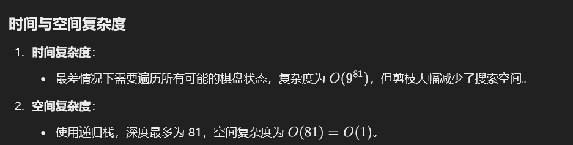

# 37. 解数独

### 思路（<font style="color:#DF2A3F;">困难题看看得了）</font>）
### 解题思路
解数独问题是一个经典的**回溯法**问题，基本思路如下：

1. **遍历棋盘**：
    - 依次检查每个空白格是否可以填入数字 `1-9`。
    - 如果当前数字满足数独规则（行、列、宫内无冲突），填入数字并递归尝试下一个空格。
2. **递归回溯**：
    - 如果填入数字导致后续无法完成，撤销本次选择（回溯），尝试下一个数字。
3. **终止条件**：
    - 如果所有空格都被填满，则找到一个合法解。

---

```java
public class Solution {
    public void solveSudoku(char[][] board) {
        backtrack(board);
    }

    private boolean backtrack(char[][] board) {
        for (int row = 0; row < 9; row++) {
            for (int col = 0; col < 9; col++) {
                // 找到空白位置
                if (board[row][col] == '.') {
                    for (char num = '1'; num <= '9'; num++) {
                        if (isValid(board, row, col, num)) {
                            board[row][col] = num; // 放置数字
                            if (backtrack(board)) { // 递归处理下一个空格
                                return true;
                            }
                            board[row][col] = '.'; // 回溯，撤销选择
                        }
                    }
                    return false; // 所有数字都不合法，返回 false
                }
            }
        }
        return true; // 没有空格，表示找到解
    }

    private boolean isValid(char[][] board, int row, int col, char num) {
        for (int i = 0; i < 9; i++) {
            // 检查行和列
            if (board[row][i] == num || board[i][col] == num) {
                return false;
            }
            // 检查 3x3 宫
            int subRow = 3 * (row / 3) + i / 3;
            int subCol = 3 * (col / 3) + i % 3;
            if (board[subRow][subCol] == num) {
                return false;
            }
        }
        return true; // 没有冲突
    }
}

```




> 更新: 2025-01-02 22:38:17  
> 原文: <https://www.yuque.com/neumx/ko4psh/hhzpg3vp6btshqov>