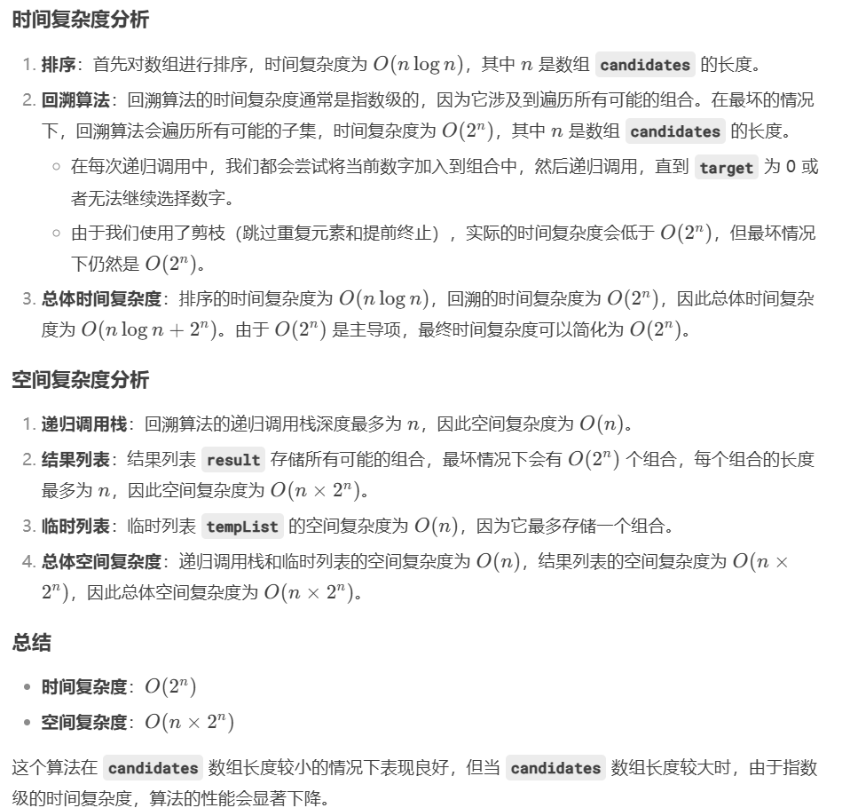

# 40. 组合总和 II

### 思路（先<font style="color:#DF2A3F;">排序，然后剪枝+去重</font>，依旧是 target-i）
+ 这道题是经典的组合总和问题，不同之处在于：
+ 每个数字在每个组合中只能使用一次。
+ 需要避免重复的组合。

#### 思路：
1. **回溯法**：使用回溯算法（DFS）来枚举所有可能的组合。
2. **排序**：为了避免重复的组合，首先对 `candidates` 数组进行排序。
3. **剪枝**：在回溯的过程中，当某个候选值大于当前目标时，可以提前结束这个分支。
4. **去重**：在处理每个候选值时，如果当前候选值与前一个值相同，且前一个值在当前组合中没有被使用，则跳过当前候选值。这可以避免组合中的重复。

---

```java
import java.util.*;

public class Solution {
    public List<List<Integer>> combinationSum2(int[] candidates, int target) {
        List<List<Integer>> result = new ArrayList<>();
        Arrays.sort(candidates);  // 排序以便去重
        backtrack(result, new ArrayList<>(), candidates, target, 0);
        return result;
    }

    private void backtrack(List<List<Integer>> result, List<Integer> tempList, int[] candidates, int target, int start) {
        if (target == 0) {
            result.add(new ArrayList<>(tempList));  // 目标为0时，添加当前组合到结果中
            return;
        }
        
        for (int i = start; i < candidates.length; i++) {
            // 剪枝：如果当前数大于目标值，后续的数也会大于目标值，直接结束
            if (candidates[i] > target) {
                break;
            }
            // 去重：跳过重复的元素
            if (i > start && candidates[i] == candidates[i - 1]) {
                continue;
            }
            // 选择当前数字
            tempList.add(candidates[i]);
            // 递归调用，target减去当前数字，下一次选择从i+1开始
            backtrack(result, tempList, candidates, target - candidates[i], i + 1);
            // 撤销选择，回到上一状态
            tempList.remove(tempList.size() - 1);
        }
    }
}

```


+ 


> 更新: 2024-12-29 21:01:26  
> 原文: <https://www.yuque.com/neumx/ko4psh/ntbz7t6qcoy3hk15>