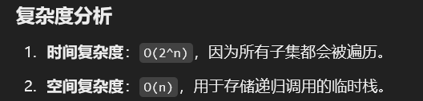

# 46. 全排列

### 思路（<font style="color:#DF2A3F;">List 去重，如果包含重复的就 continue</font>）list也包含contains方法
### 思路：
1. **回溯框架**：
    - 使用回溯算法遍历所有可能的排列。
    - 通过递归和回溯，逐步构建排列。
2. **核心逻辑**：
    - 如果当前排列的长度等于数组长度，说明已经生成一个完整的排列，将其加入结果。
    - 遍历数组中的每个元素：
        * **如果元素已经在当前排列中，跳过（避免重复使用）。**
        * 将元素加入当前排列，递归生成后续排列。
        * 回溯：移除最后一个元素，尝试其他可能性。

---

```java
class Solution {
    public List<List<Integer>> permute(int[] nums) {
        // 创建一个结果列表用于存储所有排列结果
        List<List<Integer>> res = new ArrayList<>();
        // 创建一个跟踪列表用于跟踪当前排列的元素
        List<Integer> track = new ArrayList<>();
        // 调用回溯函数来生成所有排列
        backtrack(nums, track, res);
        // 返回结果列表
        return res;
    }

    private void backtrack(int[] nums, List<Integer> track, List<List<Integer>> res) {
        // 如果当前跟踪列表的长度等于输入数组的长度，说明已经生成一个完整的排列
        if (track.size() == nums.length) {
            // 将当前跟踪列表添加到结果列表中
            res.add(new ArrayList(track));
            return;
        }

        // 遍历输入数组中的每个元素
        for (int num : nums) {
            // 如果当前元素已经在跟踪列表中，则跳过
            if (track.contains(num)) {
                continue;
            }
            // 将当前元素添加到跟踪列表中
            track.add(num);
            // 递归调用回溯函数生成后续的排列
            backtrack(nums, track, res);
            // 回退到上一层，移除当前元素
            track.remove(track.size() - 1);
        }
    }
}
```




> 更新: 2025-01-01 22:00:13  
> 原文: <https://www.yuque.com/neumx/ko4psh/oqoq4nb6ng3d7gww>