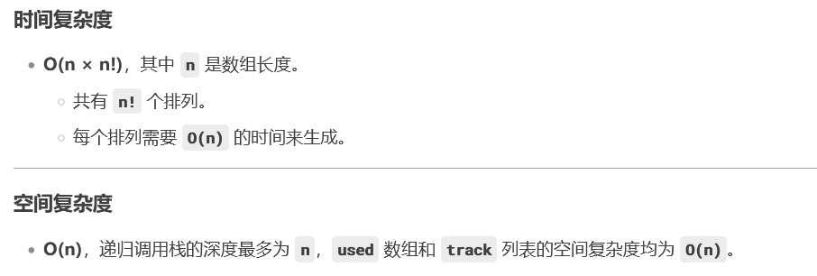

# 47. 全排列 II

### 思路（<font style="color:#DF2A3F;">排序+如果当前数字与前一个数字相同，且前一个数字未被使用过，跳过（去重）</font>）
### 与普通全排列问题不同，这道题的输入数组中可能包含重复数字，因此需要避免生成重复的排列。例如，对于输入 `nums = [1, 1, 2]`，如果直接使用普通全排列的方法，会生成多个重复的 `[1, 1, 2]` 排列。
**<font style="color:#DF2A3F;">当“前一个相同数字未被使用”时，说明在当前递归过程中已经跳过了前一个数字。这意味着：</font>**

1. **<font style="color:#DF2A3F;">前一个数字已经在之前的递归中处理过</font>****<font style="color:#DF2A3F;">。</font>**
2. **<font style="color:#DF2A3F;">如果我们再次选择当前数字（后一个相同的数字），会生成和前一个数字相同的排列，从而导致重复。</font>**

---

### 解决思路
1. **排序**：
    - 首先对数组进行排序，使相同的数字相邻，方便后续去重。
2. **回溯 + 剪枝**：
    - 使用回溯算法生成所有排列。
    - 在每一层递归中，如果当前数字与前一个数字相同，并且前一个数字未被使用过，则跳过（避免重复）。
3. **去重逻辑**：
    - 使用一个 `boolean` 数组 `used` 记录每个数字是否被使用过。
    - 如果 `nums[i] == nums[i - 1]` 且 `!used[i - 1]`，说明当前数字与前一个数字相同，且前一个数字未被使用过，跳过。
    - **<font style="color:#DF2A3F;">排序后，相同的数字相邻。</font>**`**<font style="color:#DF2A3F;">!used[i - 1]</font>**`**<font style="color:#DF2A3F;"> 确保每个重复数字只会在前一个数字已被使用的情况下被使用，避免重复排列。</font>**

---

```java
import java.util.ArrayList;
import java.util.Arrays;
import java.util.List;

public class Solution {
    public List<List<Integer>> permuteUnique(int[] nums) {
        List<List<Integer>> res = new ArrayList<>(); // 存储结果
        Arrays.sort(nums); // 排序，方便去重
        backtrack(nums, new boolean[nums.length], new ArrayList<>(), res); // 回溯
        return res;
    }

    private void backtrack(int[] nums, boolean[] used, List<Integer> track, List<List<Integer>> res) {
        if (track.size() == nums.length) { // 当前排列完成
            res.add(new ArrayList<>(track)); // 加入结果
            return;
        }
        for (int i = 0; i < nums.length; i++) {
            // 如果当前数字已被使用，跳过
            if (used[i]) continue;
            // 如果当前数字与前一个数字相同，且前一个数字未被使用过，跳过（去重）
            if (i > 0 && nums[i] == nums[i - 1] && !used[i - 1]) continue;

            used[i] = true; // 标记当前数字已使用
            track.add(nums[i]); // 选择当前数字
            backtrack(nums, used, track, res); // 递归生成后续排列
            track.remove(track.size() - 1); // 回溯，撤销选择
            used[i] = false; // 标记当前数字未使用
        }
    }
}
```




> 更新: 2025-01-01 22:13:07  
> 原文: <https://www.yuque.com/neumx/ko4psh/ub9ggrh64ew2ggle>