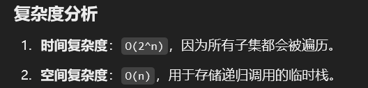

# 491. 非递减子序列

### 思路（<font style="color:#DF2A3F;">数组排序+set 去重+保持递增顺序</font>）
### 解题思路
1. **回溯法**：通过回溯法生成所有可能的子序列。
2. **去重处理**：
    - 使用 `Set` 防止同一层递归中重复选择相同的数字。
    - 递归过程中，跳过非递增的数字。
3. **判断条件**：
    - 如果子序列长度大于 1，则将其加入结果列表。

---

```java
public class Solution {
    public static List<List<Integer>> findSubsequences(int[] nums) {
        List<List<Integer>> result = new ArrayList<>(); // 用于存储最终结果
        backtrack(nums, 0, new ArrayList<>(), result); // 调用回溯方法
        return result;
    }

    private static void backtrack(int[] nums, int start, List<Integer> tempList, List<List<Integer>> result) {
        // 如果当前子序列的长度大于1，将其加入结果列表
        if (tempList.size() > 1) {
            result.add(new ArrayList<>(tempList)); // 注意：需要新建一个列表，避免引用问题
        }

        Set<Integer> used = new HashSet<>(); // 用于记录本层递归中已经使用过的数字，避免重复
        for (int i = start; i < nums.length; i++) {
            // 如果当前数字小于子序列的最后一个数字，跳过（确保子序列非递减）
            if (!tempList.isEmpty() && nums[i] < tempList.get(tempList.size() - 1)) {
                continue;
            }

            // 如果当前数字在本层递归中已经使用过，跳过（避免重复子序列）
            if (used.contains(nums[i])) {
                continue;
            }

            used.add(nums[i]); // 标记当前数字已使用
            tempList.add(nums[i]); // 将当前数字加入子序列
            backtrack(nums, i + 1, tempList, result); // 递归处理下一个位置
            tempList.remove(tempList.size() - 1); // 回溯：移除最后一个数字，尝试其他可能性
        }
    }
}
```




> 更新: 2025-01-01 21:50:28  
> 原文: <https://www.yuque.com/neumx/ko4psh/bikngbm3cnk2cino>