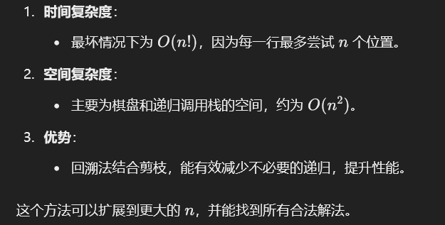

# 51. N 皇后

### 思路（<font style="color:#DF2A3F;">困难题看看得了）</font>）


### **解决方案：回溯 + 剪枝**
1. **回溯框架**：
    - 每次尝试在当前行放置一个皇后，递归处理下一行。
    - 如果当前行已经完成，记录方案；否则回退（撤销当前选择）。
2. **剪枝优化**：
    - 检查放置皇后的位置是否与之前放置的皇后冲突。
    - 冲突条件：
        * 同一列
        * 左上对角线
        * 右上对角线
3. **构造结果**：
    - 用二维数组表示棋盘，最终将其转换为字符串列表输出。

---

```java
import java.util.*;

public class Solution {
    public List<List<String>> solveNQueens(int n) {
        List<List<String>> solutions = new ArrayList<>();
        char[][] board = new char[n][n];
        // 初始化棋盘，每个位置都为空（用 '.' 表示）
        for (int i = 0; i < n; i++) {
            Arrays.fill(board[i], '.');
        }
        backtrack(solutions, board, 0, n);
        return solutions;
    }

    private void backtrack(List<List<String>> solutions, char[][] board, int row, int n) {
        // 如果所有行都放置了皇后，记录结果
        if (row == n) {
            solutions.add(construct(board));
            return;
        }

        // 尝试在当前行的每一列放置皇后
        for (int col = 0; col < n; col++) {
            if (isValid(board, row, col, n)) {
                board[row][col] = 'Q'; // 放置皇后
                backtrack(solutions, board, row + 1, n); // 递归处理下一行
                board[row][col] = '.'; // 回溯，撤销当前放置
            }
        }
    }

    private boolean isValid(char[][] board, int row, int col, int n) {
        // 检查列是否有冲突
        for (int i = 0; i < row; i++) {
            if (board[i][col] == 'Q') {
                return false;
            }
        }
        // 检查左上对角线是否有冲突
        for (int i = row - 1, j = col - 1; i >= 0 && j >= 0; i--, j--) {
            if (board[i][j] == 'Q') {
                return false;
            }
        }
        // 检查右上对角线是否有冲突
        for (int i = row - 1, j = col + 1; i >= 0 && j < n; i--, j++) {
            if (board[i][j] == 'Q') {
                return false;
            }
        }
        return true;
    }

    private List<String> construct(char[][] board) {
        List<String> result = new ArrayList<>();
        for (char[] row : board) {
            result.add(new String(row));
        }
        return result;
    }

}

```




> 更新: 2025-01-02 22:35:21  
> 原文: <https://www.yuque.com/neumx/ko4psh/ckfsad0ge8d0br2o>