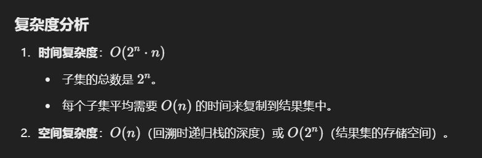

# 78. 子集

### 思路（<font style="color:#DF2A3F;">这个子集问题没有终止条件，收集所有节点，遍历完就算终止了</font>）
1. **回溯法**：
    - 通过递归逐步构造子集。
    - 每个元素都有两种选择：加入当前子集或不加入。
    - 回溯的终点是遍历完整个数组。
2. **迭代法**：
    - 从空集开始，每次将新元素添加到已有的所有子集，形成新的子集。

---

```java

public class Solution {
    // 主函数，返回数组nums的所有子集
    public List<List<Integer>> subsets(int[] nums) {
        // 存储所有子集的结果集
        List<List<Integer>> res = new ArrayList<>();
        // 存储当前子集的路径
        List<Integer> track = new ArrayList<>();
        // 调用回溯函数，从索引0开始
        backtrack(0, nums, track, res);
        // 返回所有子集的结果
        return res;
    }

    // 回溯函数，用于递归生成子集
    private void backtrack(int start, int[] nums, List<Integer> track, List<List<Integer>> res) {
        // 将当前路径加入到结果集中，因为路径本身就是子集
        res.add(new ArrayList<>(track));
        // 从start开始遍历数组，尝试添加每一个元素到路径中
        for (int i = start; i < nums.length; i++) {
            // 做选择：将nums[i]添加到当前路径track中
            track.add(nums[i]);
            // 递归地继续构造子集，传入i+1，表示下一轮选择的起始位置
            backtrack(i + 1, nums, track, res);
            // 撤销选择：将最后添加的元素从路径track中移除，以便尝试其他可能的元素
            track.remove(track.size() - 1);
        }
    }
```




> 更新: 2024-12-30 21:59:40  
> 原文: <https://www.yuque.com/neumx/ko4psh/skbc2rrqtge8gno1>