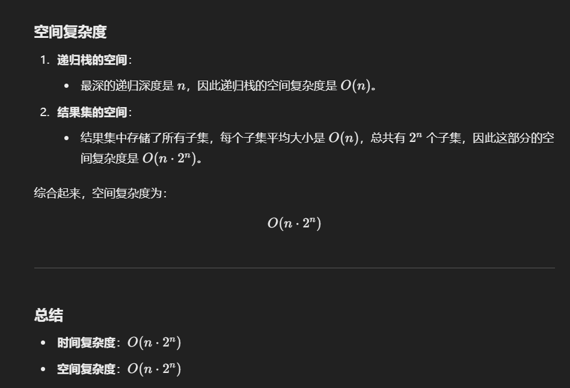

# 90. 子集 II

### 思路（<font style="color:#DF2A3F;">数组排序+去重</font>）
// **去重逻辑：跳过重复元素**if (i > start && nums[i] == nums[i - 1]) continue;  

#### 回溯法 + 剪枝去重
在生成子集时，为了避免重复子集的出现：

1. **排序数组**：
    - 先对 `nums` 数组进行排序，使重复的元素排列在一起，便于处理。
2. **跳过重复元素**：
    - 在递归的过程中，若发现当前元素与前一个元素相同，且没有选中前一个元素，则跳过当前元素。这是因为以当前元素开头的子集已经被处理过。

---

```java
import java.util.ArrayList;
import java.util.Arrays;
import java.util.List;

public class Solution {
    // 主方法：生成所有可能的子集（包含重复元素的数组）
    public List<List<Integer>> subsetsWithDup(int[] nums) {
        List<List<Integer>> result = new ArrayList<>();
        Arrays.sort(nums); // 先对数组排序，方便后续去重
        backtrack(nums, 0, new ArrayList<>(), result); // 调用回溯函数
        return result;
    }

    // 回溯函数：递归生成子集
    private void backtrack(int[] nums, int start, List<Integer> current, List<List<Integer>> result) {
        // 将当前子集加入结果
        result.add(new ArrayList<>(current));

        // 从 start 开始逐个处理元素
        for (int i = start; i < nums.length; i++) {
            // 跳过重复元素，避免生成重复子集
            if (i > start && nums[i] == nums[i - 1]) {
                continue;
            }
            // 选择当前元素
            current.add(nums[i]); // 做选择
            backtrack(nums, i + 1, current, result); // 递归处理下一个元素
            current.remove(current.size() - 1); // 撤销选择（回溯）
        }
    }
}
```




> 更新: 2025-01-01 21:34:46  
> 原文: <https://www.yuque.com/neumx/ko4psh/zxw0bxcgr6xx55u0>