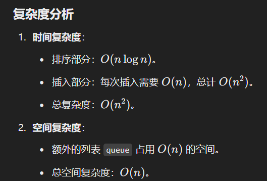

# 406. 根据身高重建队列

### 思路（**身高高的人优先插入队列，身高相同时按照 k值升序插入**。）
 贪心算法：先按身高从高到底排队，当身高相同时，k小的排在前面，这样h的相对排序就ok了，后面在插入队列的时候，只需要考虑k就行了，然后从按照k前往后插入元素，因为大的都在前面，所以保证了局部最优，最终就可以实现全局最优  

### 解题思路
这道题的核心在于如何按规则插入每个人，满足题目要求：**身高高的人优先插入队列，身高相同时按照 k值升序插入**。

#### 具体步骤
1. **排序**：
    - 按照身高 hhh 降序排序，身高相同时按照 kkk 值升序排序。
    - 这样保证高个子先处理，且相同高度的人按照要求的 kkk 值顺序排列。
2. **插入**：
    - 使用一个空列表 `queue`。
    - 按排序后的顺序依次将每个人插入 `queue`，插入的位置为其 kkk 值（即索引值）。

---

```java

class Solution {
    public int[][] reconstructQueue(int[][] people) {
        // 1. 排序
        // 对输入数组按以下规则排序：
        // - 先按身高 h 降序排序（身高高的人优先）。
        // - 如果身高相同，再按 k 值升序排序（k 值小的人优先）。
        Arrays.sort(people, (a, b) -> {
            if (a[0] == b[0]) { // 身高相同时比较 k 值
                return a[1] - b[1];
            }
            return b[0] - a[0]; // 身高不同时按身高降序排序
        });

        // 2. 插入队列
        // 使用一个列表 `queue` 来表示重建后的队列。
        List<int[]> queue = new ArrayList<>();
        for (int[] person : people) {
            // 根据 k 值插入：
            // k 表示在结果队列中，前面有 k 个人的身高 >= 当前人的身高。
            // 因为已经按身高降序排序，插入时直接将 person 插入到索引为 k 的位置。
            queue.add(person[1], person);
        }

        // 3. 转换为二维数组返回结果
        // List<int[]> 转换为 int[][] 类型。
        return queue.toArray(new int[queue.size()][]);
    }
}

```

### 时复杂度分析
+ 


> 更新: 2025-01-12 21:59:36  
> 原文: <https://www.yuque.com/neumx/ko4psh/qw96sry1qdnlf9gb>