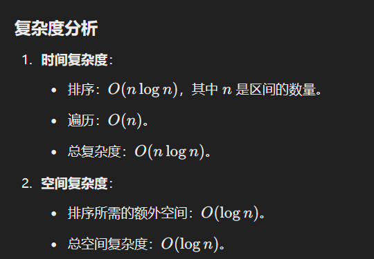

# 435. 无重叠区间

### 解题思路
这道题的目标是找到需要移除的最小数量的区间，使得剩余区间互不重叠。可以将问题转化为： **在所有区间中，选择最多数量的不重叠区间，然后移除其他的区间**。

#### 贪心策略：
1. **排序**：
    - 将区间按结束时间（`endi`）升序排序。
    - 这样可以尽可能多地选择不重叠的区间。
2. **选择不重叠区间**：
    - 初始化一个变量 `end` 表示当前不重叠区间的结束位置，初始值为负无穷。
    - 遍历排序后的区间：
        * 如果当前区间的起始时间大于等于 `end`，则选择该区间，并更新 `end` 为当前区间的结束时间。
        * 否则，跳过该区间（表示移除该区间）。
3. 最后，用总区间数减去选择的不重叠区间数，即为需要移除的区间数

---

```java
import java.util.Arrays;

class Solution {
    public int eraseOverlapIntervals(int[][] intervals) {
        if (intervals.length == 0) return 0;

        // 1. 按结束时间升序排序
        Arrays.sort(intervals, (a, b) -> Integer.compare(a[1], b[1]));

        // 2. 初始化变量
        int count = 0; // 记录不重叠区间的数量
        int end = Integer.MIN_VALUE; // 当前不重叠区间的结束位置

        // 3. 遍历所有区间
        for (int[] interval : intervals) {
            if (interval[0] >= end) { // 当前区间不与前一个区间重叠
                count++;
                end = interval[1]; // 更新结束位置
            }
        }

        // 4. 需要移除的区间数 = 总区间数 - 不重叠区间数
        return intervals.length - count;
    }
}

```

### 时复杂度分析
+ 


> 更新: 2025-01-12 22:07:20  
> 原文: <https://www.yuque.com/neumx/ko4psh/pzp4pes1n3tzrovn>