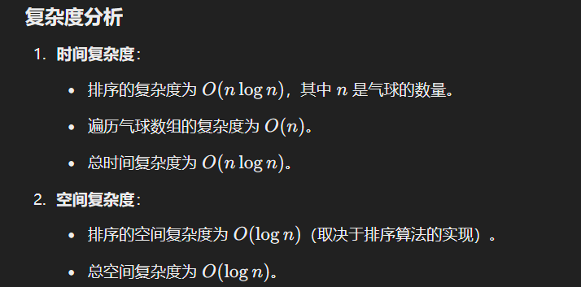

# 452. 用最少数量的箭引爆气球

### 解题思路
这道题可以转换为一个经典的**区间问题**：如何找到最少数量的区间覆盖点，使得所有区间都被覆盖。

#### 具体步骤：
1. **排序**：
    - 按照气球的结束坐标（`xend`）升序排序。
    - 这样可以尽早选定一个箭的位置，尽可能覆盖更多的气球。
2. **贪心策略**：
    - 使用一支箭从当前最小的结束坐标处射出，可以引爆所有与该结束坐标相交的气球。
    - 然后移动到下一个尚未引爆的气球，重复上述过程。

#### 算法步骤
1. 对 `points` 按 `xend` 升序排序。
2. 初始化变量：
    - `arrows` 表示箭的数量，初始值为 0。
    - `end` 表示当前箭的覆盖范围，初始值为负无穷（尚未射箭）。
3. 遍历排序后的 `points`：
    - 如果当前气球的起始坐标 `xstart` 大于 `end`，说明需要一支新箭。
        * 增加箭的数量。
        * 更新 `end` 为当前气球的结束坐标。
4. 返回箭的数量。

---

```java
import java.util.Arrays;

class Solution {
    public int findMinArrowShots(int[][] points) {
        // 如果气球数量为 0，直接返回 0
        if (points.length == 0) return 0;

        // 1. 按气球的结束坐标升序排序
        Arrays.sort(points, (a, b) -> Integer.compare(a[1], b[1]));

        // 2. 初始化箭的数量和覆盖范围
        int arrows = 0; // 记录需要的箭的数量
        long end = Long.MIN_VALUE; // 当前覆盖范围的结束坐标，初始化为最小值（防止整数溢出）

        // 3. 遍历所有气球
        for (int[] point : points) {
            // 如果当前气球的起始坐标大于当前覆盖范围的结束坐标
            if (point[0] > end) {
                arrows++; // 需要一支新箭
                end = point[1]; // 更新覆盖范围的结束坐标为当前气球的结束坐标
            }
            // 如果当前气球的起始坐标小于等于当前覆盖范围的结束坐标，
            // 说明当前箭可以射穿这个气球，不需要额外处理
        }

        // 返回需要的箭的数量
        return arrows;
    }
}
```

### 时复杂度分析
+ 


> 更新: 2025-01-12 22:04:24  
> 原文: <https://www.yuque.com/neumx/ko4psh/txhny9f50vr93112>