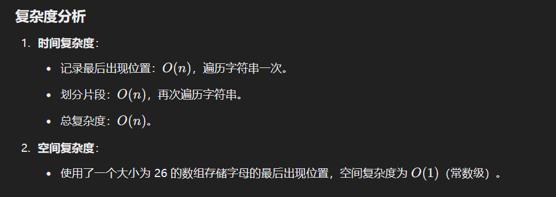

# 763. 划分字母区间

### 解题思路（<font style="color:#DF2A3F;">首先记录每个字符串的最后位置，然后遍历字符串，当遍历到这个字符串的最后位置，就记录长度</font>）
本题的目标是将字符串分为尽可能多的片段，并保证同一字母最多出现在一个片段中。这可以通过以下步骤解决：

#### 1. 记录每个字符的最后出现位置
+ 遍历字符串 `s`，记录每个字符在字符串中的最后出现位置，存储在一个哈希表或数组中。
+ 这样，我们可以知道一个字母在当前区间的最大结束位置。

#### 2. 划分片段
+ 遍历字符串，同时维护两个变量：
    - `start`：表示当前片段的起始位置。
    - `end`：表示当前片段的结束位置，初始为 0。
+ 每遍历一个字符，更新当前片段的结束位置 `end = max(end, 最后出现的位置)`。
+ 如果当前索引到达 `end`，说明当前片段结束，计算片段长度并存储到结果列表中，更新 `start` 为下一个片段的起始位置。

#### 3. 返回结果
+ 返回存储每个片段长度的列表。

---

```java
public class Solution {
    public List<Integer> partitionLabels(String s) {
        // 存储每个字符最后出现的位置
        // 因为题目中字符串只包含小写字母，所以可以用一个长度为 26 的数组
        int[] last = new int[26];
        
        // 遍历字符串，记录每个字符的最后出现位置
        for (int i = 0; i < s.length(); i++) {
            // 字符 'a' 对应数组中的索引 0，'b' 对应索引 1，依此类推
            // 通过 's.charAt(i) - 'a'' 来获取字符对应的数组索引，并将该字符最后出现的位置记录在 last 数组中
            last[s.charAt(i) - 'a'] = i;
        }

        // 结果列表，用于存储每个片段的长度
        List<Integer> partitions = new ArrayList<>();
        
        // 记录当前片段的开始位置 start 和最远边界 end
        int start = 0, end = 0;

        // 再次遍历字符串，进行划分
        for (int i = 0; i < s.length(); i++) {
            // 更新当前片段的最远边界
            // end 始终是当前片段内所有字符最后一次出现位置的最大值
            end = Math.max(end, last[s.charAt(i) - 'a']);
            
            // 当遍历到当前片段的最远边界时，说明可以确定一个片段
            if (i == end) {
                // 计算该片段的长度并加入到结果列表中
                partitions.add(end - start + 1);
                // 更新下一个片段的开始位置
                start = i + 1;
            }
        }

        // 返回结果列表，包含每个片段的长度
        return partitions;
    }
}
```

### 时复杂度分析



> 更新: 2025-01-12 22:18:00  
> 原文: <https://www.yuque.com/neumx/ko4psh/ui21hub3oaxll5v3>